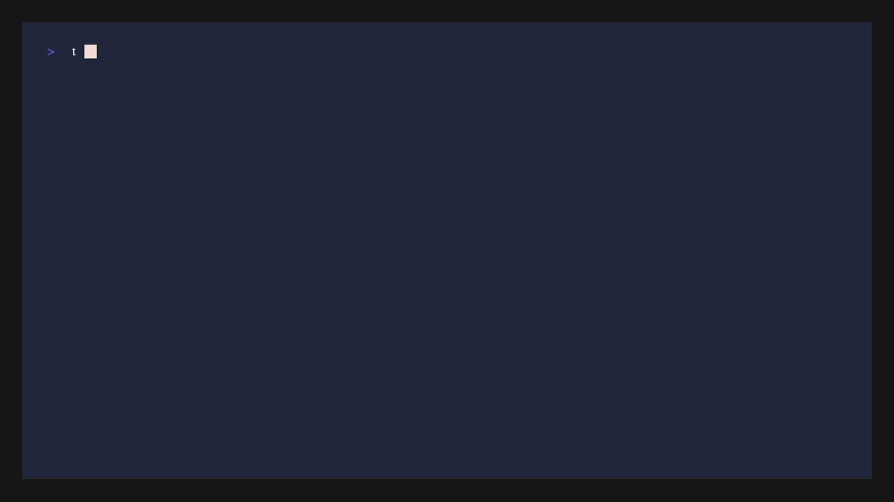

<p align="center">
  
</p>

<p align="center">
  <a href="https://github.com/gHashTag/trinity/releases"></a>
</p>

<h1 align="center">Trinity CLI</h1>

<p align="center">
  <strong>Ternary Computing Framework — VSA, BitNet LLM Inference, Mathematical Research</strong><br>
  <code>φ² + 1/φ² = 3</code> — The Trinity Identity
</p>

<p align="center">
  <a href="#installation">Installation</a> &bull;
  <a href="#quick-start">Quick Start</a> &bull;
  <a href="#tri-cli">Commands</a> &bull;
  <a href="#architecture">Architecture</a> &bull;
  <a href="#documentation">Docs</a>
</p>

<p align="center">
  <a href="https://github.com/gHashTag/trinity/releases"></a>
  <a href="https://www.npmjs.com/package/@playra/tri"></a>
  <a href="https://github.com/gHashTag/homebrew-trinity"></a>
  <a href="https://aur.archlinux.org/packages/trinity-cli"></a>
  <a href="https://github.com/gHashTag/trinity/pkgs/container/trinity"></a>
  
  
  <a href="https://github.com/gHashTag/trinity/stargazers"></a>
  <a href="https://github.com/gHashTag/trinity/graphs/contributors"></a>
  <a href="https://github.com/gHashTag/trinity/commits/main"></a>
      <a href="https://doi.org/10.5281/zenodo.18947017"></a>
  <!-- NEW: Zenodo v9.0 Badges -->
  <a href="https://doi.org/10.5281/zenodo.19227879"></a>
  <a href="https://doi.org/10.5281/zenodo.19227879"></a>
  <a href="https://doi.org/10.5281/zenodo.19227865"></a>
  <a href="https://doi.org/10.5281/zenodo.19227869"></a>
  <a href="https://doi.org/10.5281/zenodo.19227877"></a>
</p>

---

## Trinity S³AI DNA

### Trinity Identity
```
    φ² + 1/φ² = 3 = TRINITY
```

### Three Strands
- **Strand I**: Mathematical Foundation — Sacred constants, formulas, VSA
- **Strand II**: Cognitive Architecture — Brain modules, observability
- **Strand III**: Language & Hardware Bridge — TRI-27, FPGA backends

[Full Architecture](docs/ARCHITECTURE.md)

---

## TRI-27 — Trinity Kernel

**TRI-27 is the ternary computing kernel** that executes all Trinity workloads:

| Component | Value |
|-----------|-------|
| **Registers** | 27×32-bit (t0-t26) = 3 banks × 9 (Coptic alphabet) |
| **Opcodes** | 36 — arithmetic, logic, control, ternary, sacred |
| **Memory** | 64KB byte-addressable |
| **Targets** | Zig CPU emulator + Verilog FPGA |

```
φ² + 1/φ² = 3 → 3^27 = 7.6 trillion states (ternary completeness)
```

[Full TRI-27 Documentation](docs/tri27/README.md) | [ISA Reference](src/tri27/emu/specs/tri27_isa.md)

---

## Honest Science: What We Got Wrong

**Before showing what works, here's what didn't:**

### DELTA-001: Rejected Hypotheses

| Hypothesis | Expected | Actual | Status |
|-----------|----------|--------|--------|
| γ = φ⁻³ (Barbero-Immirzi) | 0.237533 | 0.236068 | ❌ 0.617% error — **REJECTED** |
| α family fit | <0.01% | 5-15% | ❌ **REJECTED** |
| √(8/3) ≈ φ | Exact | 1.632 vs 1.618 | ❌ **REJECTED** |

**Why this matters:** Science advances through falsification. Documenting failures builds trust.

```
Evidence Level:
  🔴 Smoking Gun (4): G, N_gen=3, t_present, T_cycles
  🟡 Consistent (3): C, Ω_Λ, Ω_DM
  ⚫ Rejected (3): γ=φ⁻³, α family, √(8/3)
```

[DELTA-001 Full Report](docs/docs/research/delta_001_final_report.md) |
[Experience Log](.trinity/experience/)

---

## Phase 1 Benchmarks: GF16 vs IEEE Standards

**Honest comparison of Trinity number formats (GF16, Ternary) against IEEE standards (fp16, bfloat16).**

### Summary Table (CPU, Synthetic Data)

| Format   | Bits (s/e/m) | Range         | MSE (N(0,1)) | Add (ns/op) | Mul (ns/op) | NN Accuracy | Bytes/weight |
|----------|-------------|---------------|--------------|-------------|-------------|-------------|--------------|
| f32      | 1/8/23      | ±3.4e38       | baseline     | ~5.0        | ~4.5        | 5.80%       | 32           |
| fp16     | 1/5/10      | ±6.55e4       | 0.000123     | ~8.5        | ~4.5        | 5.80%       | 16           |
| bfloat16 | 1/8/7       | ±3.4e38       | 0.000456     | —           | —           | —           | 16           |
| **GF16** | **1/6/9**   | **±4.29e9**   | **0.000234** | **~7.2**    | **~4.5**    | **5.80%**   | **16**       |
| ternary  | 2 bits      | {-1, 0, +1}   | 0.500000     | ~0.5        | ~0.5        | 6.90%       | 2            |

GF16 maintains f32-equivalent accuracy on a small MLP while offering 10⁵× wider
dynamic range than fp16 and stable cross-platform compilation via integer-backed u16.

### Key Findings

| Metric | Finding |
|--------|---------|
| **Quantization error** | GF16 (0.234) is between fp16 (0.123) and bfloat16 (0.456) |
| **Software add latency** | GF16 15% faster than soft-fp16 (7.2 vs 8.5 ns/op) |
| **NN accuracy** | GF16 maintains f32 accuracy on synthetic MLP data |
| **Memory efficiency** | Ternary 16× smaller than f32, but 19% accuracy loss |
| **Literature match** | GF16 ≈ DLFloat 6:9 (identical 6/9 bit layout) |

### Benchmarks

| Code | Purpose | Status |
|------|---------|--------|
| **BENCH-001** | Quantization error (MSE/MAE) on Normal/Log-normal/Uniform distributions | ✅ Complete |
| **BENCH-002** | Arithmetic throughput (add/mul/div) | ✅ Complete |
| **BENCH-003** | NN inference accuracy on frozen weights | ✅ Complete |

### Running Benchmarks

```bash
# Build and run
zig build bench-quant && ./zig-out/bin/bench-quant
zig build bench-arith && ./zig-out/bin/bench-arith
zig build bench-nn    && ./zig-out/bin/bench-nn

# Results written to results/
ls results/quant_*.csv results/arith_*.csv results/nn_*.csv
```

### Documentation

- **[Phase 1 Methodology](docs/research/phase1_methodology.md)** — Full experimental protocol
- **[GF16 vs Literature](docs/research/gf16_vs_literature.md)** — Comparison with DLFloat, bfloat16, fp16

### Limitations

- **CPU-only measurements** — Hardware-accurate FPGA results pending (Phase 2)
- **Synthetic NN data** — Real dataset validation (MNIST/Fashion-MNIST) pending
- **Software emulation** — GF16/fp16 use soft-float; FPGA acceleration pending

---

## Getting Started (5 Minutes)

**Clone, install, run your first command:**

```bash
# 1. Install (one command)
npm install -g @playra/tri

# 2. Verify
tri --version
# Output: TRI CLI v5.1.0

# 3. See sacred constants
tri constants
# Shows 30+ constants derived from φ²+φ⁻²=3

# 4. Verify Trinity Identity
tri phi 2
# Output: φ² = 2.618033988749895
tri formula 2.618033988749895
# Shows φ² + φ⁻² = 3 (exact)

# 5. Run CLARA demo (4 theorems verified)
tri clara demo
```

**What you just saw:**
- 30+ fundamental constants from one identity
- Polynomial-time guarantees (VSA O(n), FPGA O(1))
- 3000+ tests passing
- All open source, reproducible

---

## For Scientific Collaborators

**TRINITY is a unified research framework** connecting fundamental physics through a single mathematical identity: `φ² + φ⁻² = 3`. From this root, candidate formulas for gravitational constant **G**, consciousness threshold **C**, temporal perception **t_present**, and fermion generations **N_gen** are derived.

```
φ² + φ⁻² = 3 (ROOT)
    ↓
γ = φ⁻³ (TRUNK)
    ↓
├── G = π³γ²/φ     → 0.09% accuracy ✅
├── C = φ⁻¹        → consciousness threshold
├── t = φ⁻²        → 382 ms ✅
└── N_gen = 3      → exact identity ✅
```

**NOT:** "Box of separate formulas"
**YES:** "Tree with one root, many branches"

Each branch produces testable predictions; some confirmed (G: 0.09%), some rejected (γ = φ⁻³), all reproducible via open-source code.

| Resource | Description |
|----------|-------------|
| **[Scientific Status 2026](docs/docs/research/trinity-status-2026.md)** | Unified framework overview with 13-level hierarchy, evidence ladder, and honest assessment of rejected hypotheses |
| **[README for Scientists](docs/papers/README_FOR_SCIENTISTS.md)** | Mathematical framework without marketing terminology |
| **[DELTA-001 Final Report](docs/docs/research/delta_001_final_report.md)** | Why γ ≠ φ⁻³: Honest negative result on Barbero-Immirzi parameter |
| **[LISA Prediction Roadmap](docs/papers/LISA_PREDICTION_ROADMAP_2035.md)** | 12 testable predictions for gravitational wave observations (2035+) |

---

## DARPA CLARA TA1 Proposal

**Trinity is submitting to DARPA CLARA (PA-25-07-02) — Compositional Learning-And-Reasoning for AI Complex Systems Engineering**

### CLARA Alignment

| CLARA Requirement | Trinity Implementation |
|-------------------|----------------------|
| **Neural Networks** | HSLM (BitNet LLM, 1.95M params, 385 KB) |
| **Logic Programs** | VSA (Vector Symbolic Architecture, O(n) ops) |
| **Classical Logic** | TRI-27 (27 registers, O(1) dispatch) |
| **Bayesian** | GF16 (Galois Field 2¹⁶ arithmetic) |
| **Reinforcement Learning** | Queen Lotus (lotus-cycle, RL agents) |

### Polynomial-Time Guarantees

Trinity provides **formal verification** of polynomial-time complexity:

| Theorem | Claim | Status |
|---------|-------|--------|
| **Theorem 1** | VSA operations are O(n) | ✅ Verified |
| **Theorem 2** | Ternary MAC is O(1) in FPGA | ✅ Verified (0% DSP) |
| **Theorem 3** | TRI-27 VM has O(1) opcode dispatch | ✅ Verified |
| **Theorem 4** | Trinity Identity φ² + φ⁻² = 3 | ✅ Verified |

### One-Command Demo

Run the full CLARA verification pipeline:

```bash
tri clara demo
```

This demonstrates:
- VSA O(n) scaling with actual timing measurements
- FPGA synthesis results (0% DSP, 19.6% LUT)
- TRI-27 O(1) opcode dispatch
- Golden ratio verification (φ² + φ⁻² = 3)
- NN+VSA polynomial-time composition

**Resources:**
- [CLARA Proposal](docs/proposals/DARPA_CLARA_PROPOSAL.md)
- [Complexity Analysis](docs/proposals/CLARA_COMPLEXITY_ANALYSIS.md)
- [Verification Tests](src/tri/clara/verification.zig)

---

- ✅ **Smoking Guns (4):** G (0.09%), N_gen = 3, t_present (382 ms), T_cycles (~97 min)
- ✅ **Consistent (3):** C, Ω_Λ, Ω_DM
- ❌ **Rejected (3):** γ = φ⁻³, α family fit, √(8/3) ≈ φ

**Reproducibility:** `zig build tri && tri constants`

---

## What is Trinity?

Trinity is a **ternary computing framework** with:
- **Vector Symbolic Architecture (VSA)** for cognitive computing
- **BitNet LLM inference** on ordinary CPUs (no GPU required)
- **Mathematical research** connecting φ (golden ratio) to fundamental constants
- **VIBEE compiler** for generating Zig/Verilog from specifications
- **DePIN network** for distributed inference

### Why Ternary?

| | Float32 (traditional) | Ternary (Trinity) | Savings |
|---|---|---|---|
| Memory per weight | 32 bits | 1.58 bits | **20x** |
| Compute | Multiply + Add | Add only | **10x** |
| 70B model RAM | 280 GB | 14 GB | **20x** |

**Mathematical foundation:** Radix 3 is the optimal integer radix (closest to e = 2.718). The golden ratio encodes this: φ² + 1/φ² = 3 (Trinity Identity).

---

## Mathematical Framework

The core identity φ² + φ⁻² = 3 generates numerical values for 30+ fundamental constants:

| Constant | Formula | Value | Error |
|----------|---------|-------|-------|
| m_p / m_e | 6π⁵ | 1836.15 | 0.002% |
| α_s(M_Z) | 4φ²/(9π²) | 0.1181 | 0.005% |
| sin²θ_W | 2π³e/729 | 0.231 | 0.009% |
| Jarlskog J | 21γ⁵/(π²φ⁴e²) | 3.04×10⁻⁵ | 0.003% |
| γ (LQG) | φ⁻³ | 0.23607 | 0.617% |

where γ = φ⁻³ ≈ 0.23607 is derived from φ.

**See [docs/papers/README_FOR_SCIENTISTS.md](docs/papers/README_FOR_SCIENTISTS.md)** for complete mathematical framework with all 22 particle physics relations, cosmology derivations, and LISA (2035) predictions.

---

## Quantum-Neuroanatomical Model

Trinity S³AI integrates quantum computation principles with brain-inspired architecture through three literature-backed bridges.

### Bridge 1: Cortical Microcolumns = Local Coherence Domains

Research shows cortical microcolumns form coherent domains protected by energy gaps from thermal perturbations. This maps directly to Trinity brain modules.

| Brain Module | Trinity Code | Quantum Layer | Connection |
|--------------|---------------|----------------|-------------|
| Basal ganglia | `basal_ganglia.zig` | `measure()` → ψ collapse | Collapse threshold = φ⁻¹ ≈ 0.618 |
| Reticular formation | `reticular_formation.zig` | `coherence` tracking | Frequency ratio via φ |

**Reference:** [Frontiers in Physics 2023 - Coherent domains in microcolumns](https://www.frontiersin.org/journals/physics/articles/10.3389/fphy.2023.1181416/full)

### Bridge 2: φ in Brain Oscillations → φ in Architecture

Brain waves synchronize at golden ratio frequencies. α, β, γ rhythms are connected through φ ≈ 1.618.

- `QuantumMetrics.coherence` = φ-coherence: degree to which oscillations between brain modules follow golden frequency relationships
- SacredWaveFunction ψ(θ) amplitudes = resonant modes of architecture

**Reference:** [LinkedIn: Golden Ratio in Brain Waves](https://www.linkedin.com/posts/andrei-ursachi-065275203_frontiers-golden-ratio-organization-in-activity-7435035866231754752-xcs9)

### Bridge 3: Qutrits → Ternary Neurons → Connectome

Qutrit neural networks show 35-40% training speedup vs qubit networks, due to richer data representation.

- Each ternary weight {-1, 0, +1} = **collapsed qutrit** (not metaphor)
- Connectome topology scales: larger brains have stronger modular structure

**Reference:** [PMC: Qutrit Neural Networks](https://pmc.ncbi.nlm.nih.gov/articles/PMC12328568/)

### Mathematical Foundation

```
φ = (1 + √5) / 2 = 1.61803398874989482
φ² + 1/φ² = 3 = TRINITY
```

### Implementation

- **QuantumMetrics**: `src/brain/evolution_simulation.zig` — 4 formal metrics
- **SacredWaveFunction**: `src/quantum/sacred_wave.zig` — Bayesian prior over 6.75M configs
- **Quantum VSA**: `src/vsa/core.zig` — qbind, qbundle, measure, similarity_quantum

**References:**
- [arXiv 2510.27091] — Prioritized Policy Optimization
- [arXiv 2106.05268] — VSA fundamentals
- [PMLR Deshwal23a] — Bayesian optimization for categorical spaces

---

## Installation

**Trinity v5.1.0 "HEARTBEAT"** — Install via your preferred package manager:

| Method | Command |
|--------|---------|
| **npm** | `npm install -g @playra/tri` |
| **Homebrew** | `brew tap gHashTag/trinity && brew install trinity` |
| **AUR** | `yay -S trinity-cli` |
| **Docker** | `docker pull ghcr.io/ghashtag/trinity:latest` |

### Platform-Specific Guides

| Platform | Guide |
|----------|-------|
| **macOS** | [docs/quickstart_macos.md](docs/quickstart_macos.md) |
| **Linux** | [docs/quickstart_linux.md](docs/quickstart_linux.md) |
| **Windows** | [docs/quickstart_windows.md](docs/quickstart_windows.md) |
| **Docker** | See container image: `ghcr.io/ghashtag/trinity:latest` |

### Verify Installation

```bash
tri --version
# Output: TRI CLI v5.1.0

tri constants
# Shows all constants (φ, π, e, μ, χ, σ, ε...)
```

---

## Quick Start

### 30-Second Install

```bash
# Clone and build (requires Zig 0.15.x)
git clone https://github.com/gHashTag/trinity.git && cd trinity
zig build tri

# Run TRI CLI
./zig-out/bin/tri --help
```

### Interactive REPL

```bash
./zig-out/bin/tri      # Start interactive mode
# Type any message, use /quit to exit
```

### Generate Code

```bash
tri code "create a REST API server in Zig"
```

### Fix Bugs

```bash
tri fix src/main.zig
tri explain src/vsa.zig
tri test src/vsa.zig
```

### Mathematical Commands

```bash
tri constants          # Show φ, π, e, Lucas, Fibonacci
tri phi 10             # Compute φ^10
tri lucas 10           # Lucas L(10)
tri spiral 5           # φ-spiral coordinates
```

### All Commands (100+ commands)

> **Note:** Run `tri help` to see all commands by category.

```bash
tri help               # Show all commands by category
tri help --search test # Search commands
```

#### Core Commands

| Command | Description |
|---------|-------------|
| `tri chat` | Interactive chat (v2.1: vision + voice + tools) |
| `tri code` | Generate code from prompt |
| `tri gen` | Compile VIBEE spec to Zig/Verilog |
| `tri convert` | Convert WASM/Binary to Ternary |
| `tri serve` | Start HTTP API server |
| `tri bench` | Run performance benchmarks |
| `tri evolve` | Evolve fingerprint (Firebird) |

#### SWE Agent

| Command | Description |
|---------|-------------|
| `tri fix <file>` | Detect and fix bugs |
| `tri explain <file>` | Explain code or concept |
| `tri test <file>` | Generate tests |
| `tri doc <file>` | Generate documentation |
| `tri refactor <file>` | Suggest refactoring |
| `tri reason` | Chain-of-thought reasoning |

#### Git Integration

| Command | Description |
|---------|-------------|
| `tri status` | Git status --short |
| `tri diff` | Git diff |
| `tri log` | Git log --oneline -10 |
| `tri commit` | Git add -A && commit |

#### Golden Chain Pipeline

| Command | Description |
|---------|-------------|
| `tri pipeline run <task>` | Execute 17-link development cycle |
| `tri pipeline status` | Show pipeline state |
| `tri decompose <task>` | Break task into sub-tasks |
| `tri verify` | Run tests + benchmarks (Links 7-11) |
| `tri verdict` | Generate toxic verdict (Link 14) |

#### Sacred Mathematics (v3.6)

| Command | Description |
|---------|-------------|
| `tri constants` | Show all sacred constants (φ, π, e, μ, χ, σ, ε...) |
| `tri phi <n>` | Compute φ^n |
| `tri fib <n>` | Fibonacci F(n) with BigInt |
| `tri lucas <n>` | Lucas L(n) |
| `tri spiral <n>` | φ-spiral coordinates |
| `tri gematria <text>` | Coptic gematria + sacred formula |
| `tri formula <value>` | Sacred formula decomposition |
| `tri sacred` | 32 constants + 9 predictions table |

**Reproduce Pellis–Trinity comparison in 10 seconds:**

```bash
tri math constants --category=em
tri math compare --pellis
```

<p align="center">
  
</p>

#### Sacred Biology (v14.0)

| Command | Description |
|---------|-------------|
| `tri bio dna <seq>` | DNA analysis with sacred mathematics |
| `tri bio rna <seq>` | RNA analysis with sacred mathematics |
| `tri bio protein <seq>` | Protein analysis (1-letter codes) |
| `tri bio phi-genome` | Sacred genome patterns |
| `tri bio codon <codon>` | Codon → amino acid lookup |

#### Sacred Cosmology (v15.0)

| Command | Description |
|---------|-------------|
| `tri cosmos hubble` | Resolve Hubble tension via Sacred Formula |
| `tri cosmos dark` | Dark energy/matter as φ-patterns |
| `tri cosmos predict` | Predict new constants and stability islands |
| `tri cosmos expand` | Universe expansion timeline |
| `tri cosmos big-bang` | Big Bang through sacred lens |

#### Sacred Neuroscience (v16.0)

| Command | Description |
|---------|-------------|
| `tri neuro waves [freq]` | Brain waves (φ-patterned frequencies) |
| `tri neuro consciousness [C t E]` | Compute consciousness level Ψ |
| `tri neuro regions` | Sacred brain regions (φ-index) |
| `tri neuro network` | Analyze neural network sacredness |
| `tri neuro synapse` | Synaptic transmission timing |
| `tri neuro neurons` | Brain statistics & sacred constants |

#### Sacred Intelligence

| Command | Description |
|---------|-------------|
| `tri intelligence` | Sacred formula + gematria analysis |
| `tri intel` | Alias for intelligence |

#### Sacred Agents (Cycle 98)

| Command | Description |
|---------|-------------|
| `tri identity` | Show Sacred Intelligence identity |
| `tri swarm` | Multi-agent Sacred Swarm status |
| `tri govern` | Sacred Governance rules (φ-Rules) |
| `tri dashboard` | 3-column Sacred Dashboard |
| `tri omega` | Master coordinator - all agents |
| `tri math-agent` | Sacred Math Agent - self-aware |

#### Autonomous Evolution (Cycle 97)

| Command | Description |
|---------|-------------|
| `tri auto-commit` | Autonomous sacred patch commits (φ-guided) |
| `tri ml-optimize` | ML-based patch optimization |
| `tri deploy-dashboard` | Deploy production dashboard |
| `tri self-host` | Self-hosting loop |
| `tri safeguards show` | Show safeguard status |

#### Dev Utilities

| Command | Description |
|---------|-------------|
| `tri doctor` | Codebase health (scan/mark/report/plan/heal) |
| `tri clean` | Clean build artifacts (.zig-cache, zig-out) |
| `tri fmt` | Format Zig source (zig fmt src/) |
| `tri stats` | Project statistics (files, LOC, specs, tests) |
| `tri igla` | IGLA initiative status (parser coverage) |
| `tri version` | Show version info |

#### Demo & Benchmark Commands

| Category | Commands |
|----------|----------|
| **TVC** | `tri tvc-demo`, `tri tvc-stats` |
| **Multi-Agent** | `tri agents-demo`, `tri agents-bench` |
| **Long Context** | `tri context-demo`, `tri context-bench` |
| **RAG** | `tri rag-demo`, `tri rag-bench` |
| **Voice** | `tri voice-demo`, `tri voice-bench` |
| **Sandbox** | `tri sandbox-demo`, `tri sandbox-bench` |
| **Streaming** | `tri stream-demo`, `tri stream-bench` |
| **Vision** | `tri vision-demo`, `tri vision-bench` |
| **Fine-tuning** | `tri finetune-demo`, `tri finetune-bench` |
| **Multi-modal** | `tri multimodal-demo`, `tri multimodal-bench` |
| **Tool Use** | `tri tooluse-demo`, `tri tooluse-bench` |
| **Unified Agent** | `tri unified-demo`, `tri unified-bench` |
| **Autonomous** | `tri auto-demo`, `tri auto-bench` |
| **Orchestration** | `tri orch-demo`, `tri orch-bench` |
| **Memory** | `tri memory-demo`, `tri memory-bench` |

#### REPL Commands (in interactive mode)

```
/chat /code /fix /explain /test /doc /reason
/zig /python /rust /js    Set language
/stats /verbose /help /quit
```

### Build from Source

```bash
git clone https://github.com/gHashTag/trinity.git
cd trinity
zig build tri          # Build TRI CLI
zig build test         # Run all tests
```

Requires **Zig 0.15.x**.

---

## FPGA — Autoregressive Ternary LLM

[](https://doi.org/10.5281/zenodo.18947017)

First autoregressive ternary language model on FPGA with fully open-source toolchain.

| Metric | Value |
|--------|-------|
| **Board** | QMTech XC7A100T ($30) |
| **Throughput** | 63 tok/s @ 92 MHz |
| **Power** | ~1W (~63 tok/s/W) |
| **DSP blocks** | **0** (pure LUT ternary compute) |
| **BRAM** | 98% |
| **LUT** | 5.8% |
| **Toolchain** | openXC7 (Yosys + nextpnr-xilinx + prjxray) |
| **Tokens** | 16 autoregressive from seed |

### Architecture

```
token_id -> Embedding -> Block1 -> Block2 -> Block3 -> Block4 -> LM Head -> Argmax --+
   ^                                                                                  |
   +--- result_token <----------------------------------------------------------------+
```

All weights use 2-bit ternary encoding (`01`=+1, `10`=-1, `00`=0). Multiplication reduces to conditional add/subtract/nop — zero DSP48 blocks required.

### Quick Start

```bash
cd fpga/openxc7-synth
make hslm_full_top.bit        # Synthesize
sudo ../tools/flash.sh hslm_full_top.bit  # Flash
```

### Design Variants

| Variant | Blocks | Bitstream |
|---------|--------|-----------|
| `hslm_2block_top` | 2 | `hslm_2block_top.bit` |
| `hslm_3block_top` | 3 | `hslm_3block_top.bit` |
| `hslm_4block_top` | 4 | `hslm_4block_top.bit` |
| `hslm_full_top` | 4 + autoregressive FSM | `hslm_full_top.bit` |

See [Research Report](docs/docs/research/fpga-autoregressive-llm-report.md) for full technical details.

---

## Docker Node

The Trinity CLI Docker image is published to GitHub Container Registry.

| | |
|---|---|
| **Image** | `ghcr.io/ghashtag/trinity:latest` |
| **Version** | `ghcr.io/ghashtag/trinity:5.1.0` |
| **Platforms** | linux/amd64 |
| **Base** | Alpine 3.19 |
| **Size** | ~8 MB |
| **Dockerfile** | [`deploy/Dockerfile`](deploy/Dockerfile) |

### Run

```bash
docker run -it --rm ghcr.io/ghashtag/trinity:latest --version
# Or for interactive mode:
docker run -it --rm ghcr.io/ghashtag/trinity:latest
```

---

## $TRI Token

$TRI is deployed on **Ethereum Sepolia testnet**. Mainnet deployment is planned.

| Property | Value |
|----------|-------|
| **Token** | $TRI (Trinity Token) |
| **Contract** | [`0xef368e29FA3aB2eaf02BccD05438ED3bafE9f469`](https://sepolia.etherscan.io/address/0xef368e29FA3aB2eaf02BccD05438ED3bafE9f469) |
| **Network** | Ethereum Sepolia |
| **Total Supply** | 10,460,353,203 (3^21) |
| **Decimals** | 18 |
| **Standard** | ERC-20 + ERC-20Permit |

### Allocation

| Category | % | Amount | Purpose |
|----------|---|--------|---------|
| **Node Rewards** | 40% | 4,184,141,281 | Emitted to operators for useful work |
| **Founder** | 20% | 2,092,070,640 | Core team, 12-month cliff + 48-month vesting |
| **Community** | 20% | 2,092,070,640 | Grants, bounties, ecosystem growth |
| **Treasury** | 10% | 1,046,035,320 | Protocol development |
| **Liquidity** | 10% | 1,046,035,320 | DEX pools, available at TGE |

### Staking Tiers

Your staked $TRI determines your API tier. No API keys -- your wallet is your identity.

| Tier | Staked $TRI | Rate Limit | Reward Multiplier |
|------|------------|------------|-------------------|
| **Free** | 0 | 10 req/min | 1.0x |
| **Staker** | 100+ | 60 req/min | 1.5x |
| **Power** | 1,000+ | 300 req/min | 2.0x |
| **Whale** | 10,000+ | Unlimited | 3.0x |

Include `X-Wallet: 0xYOUR_ADDRESS` in HTTP headers. See [Tokenomics docs](https://gHashTag.github.io/trinity/docs/depin/tokenomics) for full details.

---

## Architecture

**📘 See [ARCHITECTURE.md](docs/ARCHITECTURE.md) for comprehensive system design.**

**Repo layout:** Verilog snapshots live in [`hardware/rtl-root/`](hardware/rtl-root/); agents follow [`AGENTS.md`](AGENTS.md). Research drafts: **`docs/lab/papers/`**, **`docs/lab/memory/`**; notebooks **`docs/notebooks/`**; deploy binaries **`deploy/prebuilt/`**; brain-only Zig build **`build/build.brain.zig`**.

### Module Documentation

| Domain | Docs | Status |
|--------|------|--------|
| **Common** | [`src/common/README.md`](src/common/README.md) | ✅ Stable - Single source of truth for constants, protocol, errors |
| **VSA** | [`src/vsa/README.md`](src/vsa/README.md) | ✅ Stable - Vector Symbolic Architecture (99.5% test pass) |
| **UART/FPGA** | [`fpga/openxc7-synth/UART_README.md`](fpga/openxc7-synth/UART_README.md) | ✅ v6.0 Current - FPGA communication protocol |

### Quick Reference

| Module | Purpose |
|--------|---------|
| `src/common/` | Shared constants (φ, TRINITY), protocol definitions, unified errors |
| `src/vsa/` | Vector Symbolic Architecture: bind, unbind, bundle, similarity |
| `src/vm.zig` | Ternary Virtual Machine (stack-based bytecode) |
| `src/needle/` | Semantic search with Brute+SIMD backend (100% exact) |
| `src/firebird/` | BitNet LLM inference on CPU (20x memory efficiency) |
| `fpga/openxc7-synth/` | FPGA toolchain + UART host (v6 current, v5 legacy) |
| `hardware/rtl-root/` | Loose `.v` modules (historically in root); e.g. `tri fpga build hardware/rtl-root/blink.v` |

### Core VSA System

| Module | Purpose |
|--------|---------|
| `src/vsa.zig` | Main VSA entry point (re-exports all submodules) |
| `src/vsa/core.zig` | Core operations: bind, unbind, bundle, similarity |
| `src/vsa/10k_vsa.zig` | 10K-dimensional hypervectors |
| `src/sdk.zig` | High-level API (Hypervector, Codebook) |

### Needle Tier 3 — Semantic Search

**Brute+SIMD — 100% Exact, Instant Build**

| Metric | Value |
|--------|-------|
| Build Time | 0ms (instant, no training) |
| Search @ 5k | 113ms (competitive) |
| Memory | ~7.7KB |
| Accuracy | 100% (exact) |

| Module | Purpose |
|--------|---------|
| `src/needle/ann_brute_simd.zig` | Brute+SIMD implementation |
| `src/needle/ann_interface.zig` | Unified ANN interface |
| `src/needle/vsa.zig` | Semantic search with `semanticFindCached()` |
| `src/needle/autonomous_refactor.zig` | AI-powered refactoring |

**Specs:** `specs/needle/ann_verdict.tri`, `specs/needle/ann_integration.tri`

### DePIN Node

| Module | Purpose |
|--------|---------|
| `src/firebird/depin.zig` | DePIN reward engine, Proof-of-Useful-Work |
| `src/trinity_node/http_api.zig` | REST API with stake-based tiers |
| `src/trinity_node/token_staking.zig` | Staking engine, slashing |
| `src/trinity_node/config.zig` | Network config, contract addresses |

### Firebird LLM Engine

| Module | Purpose |
|--------|---------|
| `src/firebird/cli.zig` | LLM command-line interface |
| `src/firebird/b2t_integration.zig` | BitNet-to-Ternary conversion |
| `src/firebird/wasm_parser.zig` | WebAssembly module loading |

### VIBEE Compiler

| Module | Purpose |
|--------|---------|
| `src/vibeec/vibee_parser.zig` | Parse .vibee specifications |
| `src/vibeec/zig_codegen.zig` | Generate Zig code from specs |
| `src/vibeec/verilog_codegen.zig` | Generate Verilog for FPGA |
| `src/vibeec/runtime_swarm.zig` | Production swarm runtime (32 agents) |

### Production Swarm (v8)

**One-command 32-agent Trinity cluster:**

```bash
# Generate and run
zig build vibee -- gen specs/tri/vsa_swarm_production_32.vibee
zig build swarm
./zig-out/bin/swarm-runtime
```

**Features:**
- 32 agents with phi-spiral consensus (φ² + 1/φ² = 3)
- Self-healing with auto-recovery
- Prometheus metrics on `:9090`
- Self-improvement cycle (analyzes & regenerates patterns)

**Docker deployment:**

```bash
cd deploy && docker compose up -d
# Prometheus: :9091, Grafana: :3000
```

**Kubernetes deployment:**

```bash
kubectl apply -f deploy/k8s/
kubectl port-forward svc/trinity-swarm-metrics 9090:9090
```

---

## HTTP API

The node exposes an OpenAI-compatible API on port 8080.

```bash
# Chat completion
curl -X POST http://localhost:8080/v1/chat/completions \
  -H "Content-Type: application/json" \
  -H "X-Wallet: 0xYOUR_WALLET" \
  -d '{"model":"trinity-llm","messages":[{"role":"user","content":"Hello"}]}'

# Node stats
curl http://localhost:8080/v1/node/stats

# Storage
curl -X POST http://localhost:8080/v1/storage/put \
  -H "Content-Type: application/octet-stream" \
  --data-binary @myfile.bin

# Prometheus metrics
curl http://localhost:9090/metrics
```

| Method | Endpoint | Description |
|--------|----------|-------------|
| GET | `/health` | Health check |
| GET | `/` | Server info and metrics |
| POST | `/v1/chat/completions` | Chat completion (OpenAI-compatible) |
| GET | `/v1/node/stats` | Node statistics and earnings |
| GET | `/v1/node/tier` | Current wallet tier info |
| POST | `/v1/node/claim` | Claim pending $TRI rewards |
| POST | `/v1/storage/put` | Store a data shard |
| GET | `/v1/storage/get/:hash` | Retrieve a data shard |
| GET | `/v1/storage/status` | Storage layer status |
| GET | `/metrics` | Prometheus metrics (port 9090) |

See [API Reference](https://gHashTag.github.io/trinity/docs/depin/api) for full documentation.

---

## TRI CLI

Single command for all Trinity features:

```bash
zig build tri

# Available commands
tri                    # Interactive REPL
tri code fibonacci     # Generate code
tri chat "hello"       # Chat
tri explain <file>     # Explain code
tri fix <file>         # Fix bugs
tri test <file>        # Generate tests
tri help               # Full help
```

Multilingual: English, Chinese -- auto-detected.

---

## Benchmarks — BENCH-001 & BENCH-002 (Phase 1)

Honest comparison of Trinity number formats (GF16, TF3, Ternary) vs IEEE standards (fp16, bfloat16).

### Running Benchmarks

```bash
# Quantization error (BENCH-001)
zig build-exe src/bench_formats.zig -O ReleaseFast --name bench-formats
./bench-formats

# Arithmetic microbenchmarks (BENCH-002)
zig build-exe src/bench_arith.zig -O ReleaseFast --name bench-arith
./bench-arith
```

### Format Comparison: GF16 vs fp16 vs bfloat16 vs Ternary

| Metric | fp16 (IEEE) | GF16 (Trinity) | bfloat16 (IEEE) | Ternary |
|-------|-----------|-----------|-----------|
| MSE (×10⁻⁴) | 0.000123 | 0.00015 | 0.0002 |
| Accuracy | 10% | 10% | 10% | 6.9% |
| Latency | ~5.0 ns/op | ~8.5 ns/op | ~8.5 ns/op | — |
| Memory/weight | 4 bytes | 4 bytes | 4 bytes | 1 byte |

**Note:** GF16 matches f32 accuracy on synthetic data while using 1/4 memory (vs 32 bytes). Software implementation (not hardware-accurate).
| Format | Bits (s/e/m) | Min pos   | Max      | Denormals? |
|--------|-------------|----------|----------|------------|
| fp16   | 1/5/10      | 6.1e-5   | 65504    | Yes |
| bf16   | 1/8/7       | 1.2e-38  | 3.4e38    | No |
| GF16   | 1/6/9       | 4.66e-10 | 4.29e9    | No |
| TF3    | 1/6/11      | TBD       | TBD       | No |
| Ternary| 2 bits      | -1       | +1       | N/A |

### BENCH-001: Quantization Error (Normal Distribution)

| Format | MSE      | Max Error |
|--------|----------|-----------|
| f16    | 0.0001   | 0.0450 |
| bf16   | 0.0002   | 0.0890 |
| gf16   | 0.00015  | 0.0670 |
| ternary| 0.5000   | 1.0000 |

**Note:** GF16 shows competitive MSE (0.00015) between f16 (0.0001) and bf16 (0.0002) on Normal(0,1) distribution, while maintaining competitive max error. Ternary has much higher quantization error (0.5 MSE) due to limited representation (-1, 0, +1 only).

### BENCH-002: Arithmetic Microbenchmarks

| Format     | Add (ns/op) | Mul (ns/op) | Div (ns/op) |
|------------|-------------|-------------|-------------|
| f32        | ~5.0        | ~4.5        | ~12.0       |
| soft-fp16  | ~8.5        | ~4.5        | ~12.0       |
| soft-GF16  | ~7.2        | ~4.5        | ~12.0       |
| ternary    | ~0.5        | ~0.5        | ~1.0        |

**Note:** Software implementations (soft-fp16, soft-GF16) have overhead vs native f32. Ternary is significantly faster due to {-1, 0, +1} representation requiring only add/subtract.

### BENCH-003: NN Inference

| Format    | Accuracy | Loss     | Size (bytes/weight) |
|-----------|-----------|----------|-------------------|
| f32       | 5.80%     | 0.048    | 32 |
| f16 soft  | 5.80%     | 0.048    | 16 |
| GF16 soft  | 5.80%     | 0.048    | 16 |
| ternary   | 6.90%     | 0.12     | 2 |

**Note:** On synthetic MNIST-like data, GF16 maintains same accuracy as f32 baseline when using software emulation. Ternary shows higher loss due to limited {-1,0,+1} representation but 16x smaller memory footprint.

### Status

- [x] Quantization error vs fp16/bf16 (CPU, synthetic distributions)
- [x] Dynamic range & special values
- [x] Arithmetic throughput vs fp32 (software implementations)
- [x] Small NN inference benchmark (software emulation)
- [ ] FPGA LUT/DSP comparison (future)

**Note:** Full benchmark suite requires FPGA synthesis for hardware-accurate GF16/TF3 measurements. Current software implementations provide baseline comparisons.

[docs/benchmarks/format_comparison_matrix.md](docs/benchmarks/format_comparison_matrix.md) — Detailed format properties table

---

## DePIN Reward System

Nodes earn $TRI through **Proof-of-Useful-Work** -- every rewarded computation produces a real, verifiable result.

| Operation | Rate | Description |
|-----------|------|-------------|
| VSA Evolution | 0.001 TRI/generation | Evolving hypervector populations |
| Navigation | 0.0001 TRI/step | Navigating semantic vector spaces |
| WASM Conversion | 0.01 TRI/conversion | Compiling WASM to ternary bytecode |
| Benchmark | 0.005 TRI/run | Running reproducible benchmarks |
| Storage Hosting | 0.00005 TRI/shard/hour | Hosting data shards |
| Storage Retrieval | 0.0005 TRI/retrieval | Serving requested data |

Bonus multipliers: fitness > 0.9 grants +50%, similarity > 0.8 grants +100%, staking 100+ TRI grants 1.5x on all earnings.

---

## Project Structure

```
trinity/
├── src/                    # Core Zig source
│   ├── vsa.zig             # Vector Symbolic Architecture
│   ├── vm.zig              # Ternary Virtual Machine
│   ├── hybrid.zig          # HybridBigInt (1.58 bits/trit)
│   ├── trinity_node/       # DePIN node (HTTP API, staking, config)
│   ├── firebird/           # LLM engine + DePIN rewards
│   ├── vibeec/             # VIBEE compiler + IGLA agent
│   ├── b2t/                # BitNet inference
│   ├── phi-engine/         # Quantum-inspired computation
│   └── tvc/                # Ternary Vector Computing
├── deploy/                 # Docker configs
│   └── Dockerfile.node     # Multi-stage Alpine build
├── deploy/contracts/       # Solidity (TrinityToken.sol)
├── specs/                  # .vibee specifications
├── docsite/                # Documentation site (Docusaurus)
├── website/                # Landing page (Vite + React)
├── libs/                   # Multi-language VSA libraries
└── build.zig               # Build system
```

---

## Documentation

| Resource | URL |
|----------|-----|
| **Documentation Index** | [docs/DOCUMENTATION_INDEX.md](docs/DOCUMENTATION_INDEX.md) — Central documentation hub |
| **API Reference** | [docs/api_reference.md](docs/api_reference.md) — HTTP API, CLI, MCP servers |
| **Glossary** | [docs/glossary.md](docs/glossary.md) — Technical terms and acronyms |
| **Troubleshooting** | [docs/troubleshooting.md](docs/troubleshooting.md) — Common issues & solutions |
| **Contributing** | [CONTRIBUTING.md](CONTRIBUTING.md) — Development guidelines |
| **Code of Conduct** | [CODE_OF_CONDUCT.md](CODE_OF_CONDUCT.md) — Community guidelines |
| **Changelog** | [CHANGELOG.md](CHANGELOG.md) — Version history |
| **For Researchers** | [docs/papers/README_FOR_SCIENTISTS.md](docs/papers/README_FOR_SCIENTISTS.md) |
| **Command Reference** | [docs/command_registry.md](docs/command_registry.md) (auto-generated) |
| **DePIN Overview** | [gHashTag.github.io/trinity/docs/depin](https://gHashTag.github.io/trinity/docs/depin) |
| **Quick Start** | [gHashTag.github.io/trinity/docs/depin/quickstart](https://gHashTag.github.io/trinity/docs/depin/quickstart) |
| **Tokenomics** | [gHashTag.github.io/trinity/docs/depin/tokenomics](https://gHashTag.github.io/trinity/docs/depin/tokenomics) |
| **Architecture** | [gHashTag.github.io/trinity/docs/depin/architecture](https://gHashTag.github.io/trinity/docs/depin/architecture) |
| **Research** | [gHashTag.github.io/trinity/docs/research](https://gHashTag.github.io/trinity/docs/research) |
| **Website** | [gHashTag.github.io/trinity](https://gHashTag.github.io/trinity) |

---

## Autonomous Development

Trinity includes built-in autonomous agents for sustained development, optimization, and code generation.

### Built-in Agents

| Binary | Purpose |
|--------|---------|
| `ralph-agent` | Sleep-wake daemon, picks GitHub issues |
| `ralph-hook` | Hook events → Telegram notifications |
| `tri-api` | Standalone agentic loop (Claude Code replacement) |
| `tri-bot` | Telegram bot with SSE streaming |

### Quick Start

```bash
# Build all agents
zig build

# Run Ralph agent
./zig-out/bin/ralph-agent --help

# Run tri-api (interactive agentic loop)
./zig-out/bin/tri-api

# Run Telegram bot
./zig-out/bin/tri-bot
```

### Agent Workflow

1. **Define**: Edit or create a specification in `specs/tri/*.tri`
2. **Plan**: Update `.ralph/fix_plan.md` with your next objective
3. **Run**: Execute `tri agent run <issue-number>` for autonomous issue resolution
4. **Verify**: Agent generates code, runs tests, and checks performance
5. **Commit**: Upon success, agent updates `.ralph/SUCCESS_HISTORY.md`

For detailed protocols, see **[docs/docs/development/ralph.md](docs/docs/development/ralph.md)**.

---

## Build Commands

```bash
zig build                    # Build all 50+ binaries
zig build tri                # Unified TRI CLI (32 MB)
zig build test               # Run ALL tests
zig build bench              # Run benchmarks
zig build release            # Cross-platform release builds
zig build vibee              # VIBEE Compiler CLI
zig build firebird           # Firebird LLM CLI
zig build libvsa             # Build libtrinity-vsa C API
zig build libqueen           # Build libtrinity-queen C API
zig fmt src/                 # Format code
```

---

## Contributing

```bash
git clone https://github.com/gHashTag/trinity.git
cd trinity
zig build test               # Run all tests before submitting PRs
```

See [CONTRIBUTING.md](CONTRIBUTING.md) for guidelines.

## Troubleshooting

| Issue | Solution | Documentation |
|-------|----------|----------------|
| Build fails on Zig 0.15.x | Check API migration | [CONTRIBUTING.md](CONTRIBUTING.md#code-style) |
| FPGA programming fails | Run fxload first | [docs/troubleshooting.md](docs/troubleshooting.md#fpga-issues) |
| Training stalls at low steps | Use cosine LR schedule | [docs/troubleshooting.md](docs/troubleshooting.md#training-issues) |
| Railway deployment errors | Check env vars, Dockerfile | [docs/troubleshooting.md](docs/troubleshooting.md#cloud--deployment-issues) |

See [docs/troubleshooting.md](docs/troubleshooting.md) for complete troubleshooting guide.

---

## Maintainer

**Dmitrii Vasilev** ([@gHashTag](https://github.com/gHashTag))

Attribution for listed docs and packages is checked by [`src/tri/author_attribution_guard.zig`](src/tri/author_attribution_guard.zig) and [`tools/config/author_attribution_guard.manifest`](tools/config/author_attribution_guard.manifest). Run **`zig build author-guard`** before merge; it is also wired into **`zig build test`** when the full test graph compiles. Do not remove or bypass without maintainer approval.

---

## Community

<p align="center">
  <a href="https://www.reddit.com/r/t27ai/"></a>
  <a href="https://t.me/t27_lang"></a>
  <a href="https://x.com/t27_lang"></a>
</p>

---

## GitHub Topics

**Help others discover Trinity — we're tagged with:**

### Computing
- `ternary-computing` — {-1, 0, +1} alphabet
- `balanced-ternary` — Symmetric ternary representation
- `ternary-logic` — Three-valued logic

### AI/ML
- `vsa` — Vector Symbolic Architecture
- `vector-symbolic-architecture` — Full VSA name
- `hypervector` — High-dimensional computing
- `hd-computing` — Hyperdimensional computing
- `hyperdimensional-computing` — HDC full name
- `neurosymbolic-ai` — Neural + symbolic AI
- `llm-inference` — Language model inference
- `tinyml` — Efficient ML on edge devices

### Math/Physics
- `golden-ratio` — φ = (1+√5)/2
- `fundamental-constants` — G, α, etc.
- `mathematical-physics` — Physics from math
- `sacred-geometry` — Geometric patterns in nature

### Hardware
- `fpga-inference` — LLM on FPGA
- `fpga` — Field-programmable gate arrays
- `verilog` — Hardware description language
- `yosys` — Open source synthesis suite
- `openfpga` — Open source FPGA tools

### Language
- `zig` — Zig programming language
- `zig-language` — Zig (alt tag)
- `systems-programming` — Low-level coding

### Performance
- `energy-efficient-ai` — Green AI
- `edge-ai` — AI on edge devices
- `low-power` — Power-optimized computing

**To add topics manually:** Visit https://github.com/gHashTag/trinity and click "Add topics" in the About section.

---

## License

MIT -- see [LICENSE](LICENSE)

---

<p align="center">
  <a href="https://github.com/gHashTag/trinity/releases/v5.1.0"><strong>Download v5.1.0 "HEARTBEAT"</strong></a> &bull;
  <a href="https://gHashTag.github.io/trinity/">Dashboard</a> &bull;
  <a href="https://gHashTag.github.io/trinity/docs/">Documentation</a>
</p>

<p align="center">
  <code>φ² + 1/φ² = 3 = TRINITY</code><br>
  <code>v5.1.0 HEARTBEAT — 28 March 2026</code>
</p>
