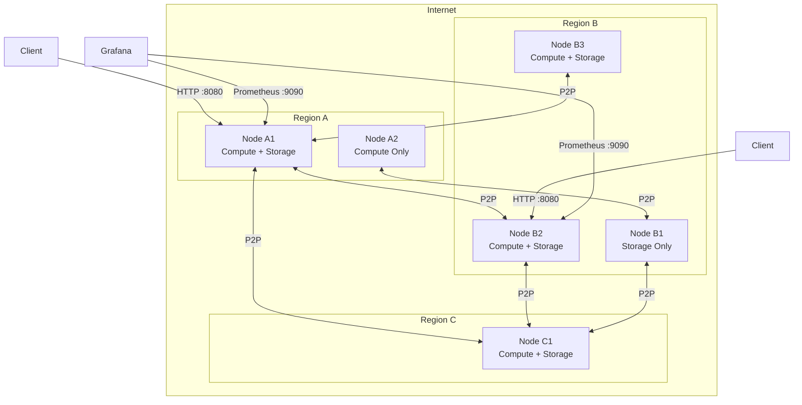
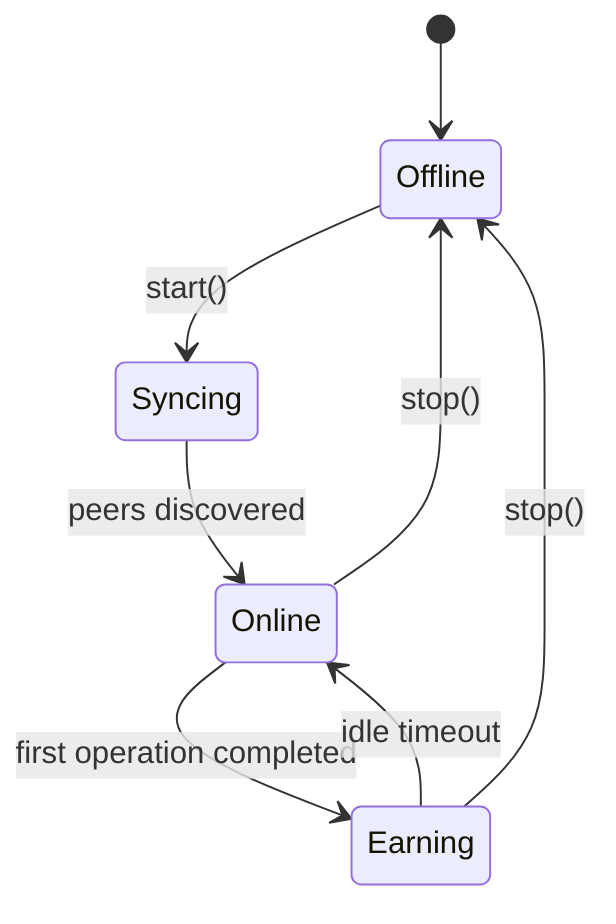
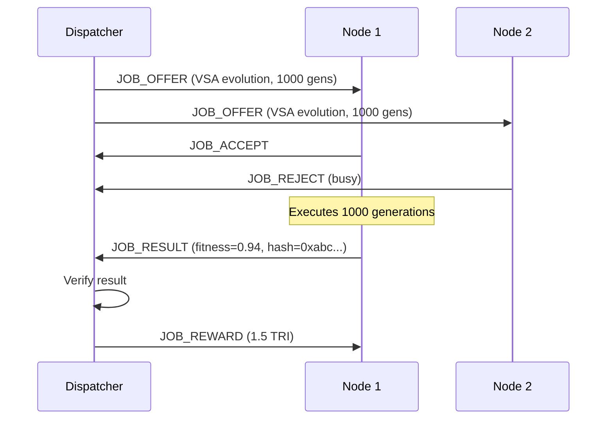
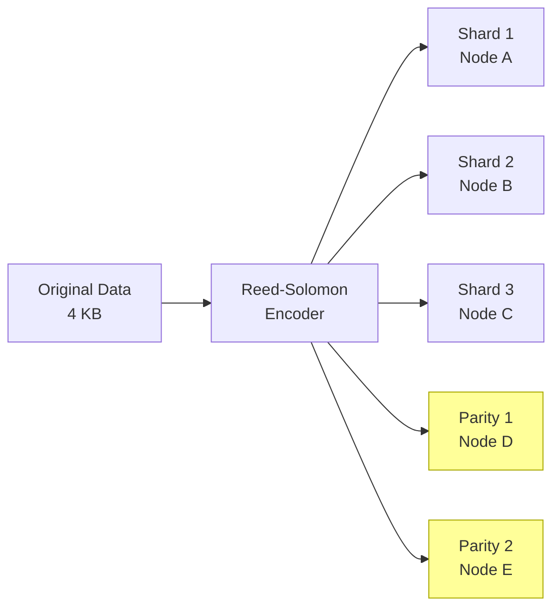

# Network Architecture

This page describes the internal architecture of the Trinity DePIN network: how nodes discover each other, distribute work, store data, and secure the system.

## Network Topology



The network is a **flat peer-to-peer mesh** with no central coordinator. Every node can communicate with every other node. Nodes self-organize into work groups based on available resources.

## Node Types and Roles

Each node self-declares its capabilities on startup.

| Role | Capabilities | Minimum Requirements |
|------|-------------|---------------------|
| **Compute Node** | VSA operations, WASM conversion, benchmarks, inference | 2 cores, 4 GB RAM |
| **Storage Node** | Shard hosting, retrieval, Reed-Solomon coding | 2 cores, 2 GB RAM, 100 GB disk |
| **Full Node** | All operations (compute + storage) | 4 cores, 8 GB RAM, 100 GB disk |

A node's role is not permanently fixed. If a compute node adds disk capacity, it can start accepting storage jobs without restarting.

### Node Lifecycle



| State | Description |
|-------|-------------|
| **Offline** | Node is not running or not reachable |
| **Syncing** | Node is discovering peers and synchronizing state |
| **Online** | Node is connected to the network and accepting jobs |
| **Earning** | Node has completed at least one paid operation in this session |

## P2P Protocol

Trinity uses a two-layer networking protocol:

### Discovery Layer (UDP 9333)

The discovery layer uses **UDP broadcast** for local peer discovery and **UDP unicast** for known peer lists.

```
┌─────────────────────────────────────────────┐
│                UDP Port 9333                 │
├─────────────────────────────────────────────┤
│  PING      → announce presence              │
│  PONG      → respond to ping                │
│  PEERS     → request peer list              │
│  PEERS_ACK → return known peers             │
│  HELLO     → initial handshake with caps    │
└─────────────────────────────────────────────┘
```

**Discovery process:**

1. New node broadcasts `PING` on UDP 9333 to the local subnet
2. Existing nodes respond with `PONG` including their capabilities
3. New node sends `PEERS` to discovered nodes to learn about more peers
4. Nodes exchange `HELLO` messages containing their capability declarations
5. Discovery runs continuously -- nodes re-ping every 30 seconds

**Message format (binary):**

```
┌──────┬──────┬────────┬─────────┐
│ Type │ Len  │ NodeID │ Payload │
│ 1B   │ 2B   │ 20B    │ var     │
└──────┴──────┴────────┴─────────┘
```

### Job Layer (TCP 9334)

The job layer uses **persistent TCP connections** for reliable job distribution and result delivery.

```
┌─────────────────────────────────────────────┐
│                TCP Port 9334                 │
├─────────────────────────────────────────────┤
│  JOB_OFFER   → dispatcher offers work       │
│  JOB_ACCEPT  → node accepts the job         │
│  JOB_REJECT  → node declines (busy/unable)  │
│  JOB_RESULT  → node returns computation     │
│  JOB_VERIFY  → dispatcher confirms result   │
│  JOB_REWARD  → reward credited to node      │
└─────────────────────────────────────────────┘
```

**Job dispatch flow:**



Jobs are dispatched using a **work-stealing** algorithm: idle nodes pull work from a global job queue rather than waiting for assignments. This maximizes utilization.

## Storage Layer

The storage subsystem provides durable, distributed data storage with erasure coding.

### Shard Architecture



| Component | Description |
|-----------|-------------|
| **Sharding** | Data is split into fixed-size shards (default 4 KB) |
| **Reed-Solomon** | Erasure coding adds parity shards for fault tolerance |
| **Replication** | Each shard is stored on 3 different nodes minimum |
| **Content addressing** | Shards are identified by their cryptographic hash |

### Reed-Solomon Parameters

| Parameter | Value | Description |
|-----------|-------|-------------|
| Data shards | 3 | Minimum shards to reconstruct |
| Parity shards | 2 | Additional redundancy shards |
| Total shards | 5 | Per original data chunk |
| Overhead | 1.67x | Storage overhead multiplier |
| Fault tolerance | 2 | Can lose up to 2 shards |

### LRU Cache

Each node maintains a Least Recently Used (LRU) cache for frequently accessed shards:

| Parameter | Default | Description |
|-----------|---------|-------------|
| Cache size | 256 MB | Maximum cache memory |
| Eviction policy | LRU | Least recently used evicted first |
| Hit rate target | \> 80% | Monitored via Prometheus |
| TTL | 720 hours (30 days) | Default shard lifetime |

Shards that fall out of the LRU cache are still persisted on disk. The cache accelerates retrieval for hot data.

### Storage Challenge Protocol

To prevent lazy nodes from claiming storage rewards without actually storing data, the network runs periodic **challenge-response** checks:

1. A random challenger node selects a shard hash
2. Challenger sends a `CHALLENGE` message with the hash and a random byte offset
3. Hosting node must respond with the correct bytes at that offset within 5 seconds
4. Failure to respond correctly results in reward withholding and reputation penalty

## Prometheus Monitoring

Every node exposes a Prometheus-compatible metrics endpoint on port **9090**.

### Key Metrics

| Metric | Type | Description |
|--------|------|-------------|
| `trinity_operations_total` | counter | Operations by type |
| `trinity_earned_tri_total` | counter | Total $TRI earned |
| `trinity_uptime_seconds` | gauge | Node uptime |
| `trinity_peers_connected` | gauge | Active peer count |
| `trinity_inference_throughput_tokens_per_second` | gauge | Inference speed |
| `trinity_storage_shards_total` | gauge | Stored shards count |
| `trinity_storage_lru_hit_rate` | gauge | Cache hit rate |
| `trinity_job_queue_depth` | gauge | Pending jobs in queue |

### Grafana Dashboard

Connect Grafana to your node's Prometheus endpoint for real-time visualization:

```yaml
# prometheus.yml
scrape_configs:
  - job_name: 'trinity-node'
    static_configs:
      - targets: ['localhost:9090']
    scrape_interval: 15s
```

## Security Model

### Threat Model

| Threat | Mitigation |
|--------|-----------|
| **Sybil attack** (fake nodes) | Staking requirement for enhanced rewards; reputation system |
| **Freeloading** (claiming rewards without work) | Verifiable proofs for every operation; challenge-response for storage |
| **Data corruption** | Reed-Solomon erasure coding; content-addressed storage with hash verification |
| **Eclipse attack** (isolating a node) | Multiple peer discovery mechanisms; minimum peer count requirement |
| **Replay attack** | Nonce-based transaction ordering; timestamp validation |

### Proof Verification

Every reward-bearing operation produces a cryptographic proof:

```
┌───────────────────────────────────────┐
│              Operation Proof           │
├───────────────────────────────────────┤
│  operation_type:  "vsa_evolution"     │
│  node_id:         0x1a2b3c...        │
│  timestamp:       1700000000         │
│  input_hash:      0xdeadbeef...      │
│  output_hash:     0xcafebabe...      │
│  result_metric:   0.94 (fitness)     │
│  signature:       0x7890ab...        │
└───────────────────────────────────────┘
```

Proofs are verified by at least one other node before rewards are credited. Invalid proofs result in:

1. Reward withholding for the operation
2. Reputation score decrease (-10 points)
3. Temporary cooldown (5 minutes) before accepting new jobs

### Network Integrity

The network maintains integrity through:

- **Minimum peer count**: Nodes must maintain at least 3 active peers to participate
- **Heartbeat**: Nodes send heartbeats every 30 seconds; 3 missed heartbeats mark a node as offline
- **Reputation**: Each node has a reputation score (0-100). Nodes below 20 are excluded from job dispatch
- **Stake slashing**: Validators with staked TRI can lose up to 10% for proven misbehavior

## Port Summary

| Port | Protocol | Service | Required |
|------|----------|---------|----------|
| 8080 | TCP | HTTP API | Yes |
| 9090 | TCP | Prometheus metrics | Recommended |
| 9333 | UDP | Peer discovery | Yes |
| 9334 | TCP | Job distribution | Yes |

## Next Steps

- [Quick Start](./quickstart.md) -- deploy your own node
- [API Reference](./api.md) -- interact with the HTTP API
- [Rewards](./rewards.md) -- understand the economics
- [Tokenomics](./tokenomics.md) -- the $TRI token model
