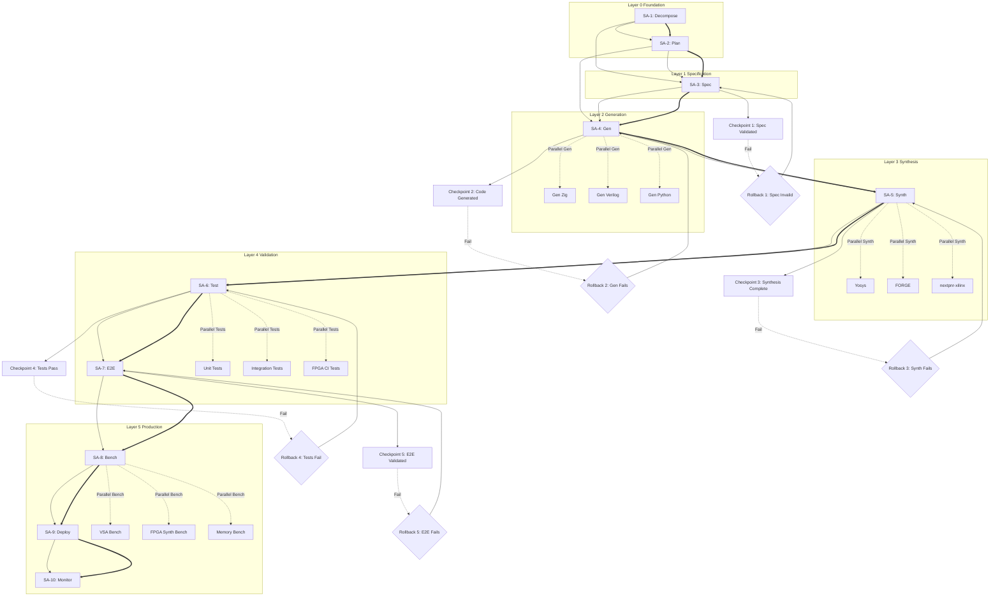

# SA-2: EXECUTION GRAPH - Full Pipeline Validation

**Date:** 2026-03-08
**Context:** Trinity v2.2.0 + Phase 3 architecture refactor complete
**Objective:** Create execution graph with dependencies and critical path for full pipeline validation

---

## Execution Graph



---

## Critical Path Analysis

| Step | Agent | Duration (est) | Bottleneck? | Dependencies | Parallelizable |
|------|-------|----------------|-------------|--------------|----------------|
| 1 | SA-1: Decompose | 5-10 min | No | Task description | Partial |
| 2 | SA-2: Plan | 10-15 min | **YES** | SA-1 output | No |
| 3 | SA-3: Spec | 15-30 min | **YES** | SA-1, SA-2 | Partial (per spec) |
| 4 | SA-4: Gen | 5-10 min | No | SA-3 specs | **Yes** (per target) |
| 5 | SA-5: Synth | 30-60 min | **YES** | SA-4 code | **Yes** (per design) |
| 6 | SA-6: Test | 10-20 min | No | SA-5 artifacts | **Yes** (test types) |
| 7 | SA-7: E2E | 20-40 min | **YES** | SA-4, SA-5, SA-6 | Partial |
| 8 | SA-8: Bench | 15-30 min | No | SA-6, SA-7 | **Yes** (bench type) |
| 9 | SA-9: Deploy | 5-10 min | No | SA-8 results | No |
| 10 | SA-10: Monitor | Ongoing | No | SA-9 deployment | Yes |

**Total Critical Path:** ~2-3 hours (sequential)
**With Parallelization:** ~45-90 min (optimized)

---

## Parallelization Opportunities

### High-Value Parallelization (2-3x speedup)

1. **SA-4: Multi-target Generation** (3x parallel)
   - Zig code generation
   - Verilog code generation
   - Python/Rust/TypeScript generation
   - **Condition:** Independent language targets from same .vibee spec

2. **SA-5: Multi-design Synthesis** (N-way parallel)
   - Yosys synthesis (per design)
   - FORGE placement (per design)
   - nextpnr-xilinx routing (per design)
   - **Condition:** Independent designs, no shared resources

3. **SA-6: Test Tiering** (3-way parallel)
   - Unit tests (fast, per module)
   - Integration tests (medium, API level)
   - FPGA CI tests (slow, full synthesis)
   - **Condition:** Test independence

4. **SA-8: Benchmark Types** (3-way parallel)
   - VSA operations (bind/unbind/bundle)
   - FPGA synthesis (place/route timing)
   - Memory/CPU profiling
   - **Condition:** Different benchmark targets

### Medium-Value Parallelization (1.5x speedup)

5. **SA-3: Spec Creation** (per spec)
   - Multiple .vibee specs can be created independently
   - **Condition:** Non-interdependent specs

6. **SA-7: E2E Testing** (per scenario)
   - Different E2E scenarios can run in parallel
   - **Condition:** Isolated test environments

---

## Checkpoints

### Checkpoint 1: Spec Validated ✅
**Location:** After SA-3 (Spec)
**Validation:**
- [ ] .vibee spec syntax valid (YAML parser)
- [ ] All required fields present (name, version, language, types, behaviors)
- [ ] Type declarations consistent
- [ ] Behavior preconditions/postconditions clear
- [ ] No circular dependencies in imports

**Commands:**
```bash
./zig-out/bin/vibee validate specs/tri/feature.vibee
yamllint specs/tri/feature.vibee
```

**Rollback if fail:** Return to SA-3, fix spec errors

---

### Checkpoint 2: Code Generated ✅
**Location:** After SA-4 (Gen)
**Validation:**
- [ ] Zig code generated: `var/trinity/output/feature.zig`
- [ ] Verilog code generated (if FPGA): `var/trinity/output/fpga/feature_fpga.v`
- [ ] File sizes non-zero
- [ ] No compiler errors in generated code
- [ ] `zig build` succeeds

**Commands:**
```bash
ls -lh var/trinity/output/feature.zig
zig test var/trinity/output/feature.zig
```

**Rollback if fail:** Return to SA-4, check codegen templates

---

### Checkpoint 3: Synthesis Complete ✅
**Location:** After SA-5 (Synth)
**Validation:**
- [ ] Yosys JSON generated: `design.json`
- [ ] FORGE placement completed: `design.place`
- [ ] nextpnr routing completed: `design.route`
- [ ] Bitstream generated: `design.bit` (if applicable)
- [ ] No critical timing violations (< 50 MHz for Artix-7)

**Commands:**
```bash
ls -lh fpga/openxc7-synth/ternary_dot.json
./zig-out/bin/forge run --input ternary_dot.json --device xc7a100t --output /tmp/ternary_dot.bit
```

**Rollback if fail:** Return to SA-3 (spec too complex) or SA-5 (toolchain issue)

---

### Checkpoint 4: Tests Pass ✅
**Location:** After SA-6 (Test)
**Validation:**
- [ ] Unit tests: `zig test` → All tests passed
- [ ] Integration tests: `zig build test` → ≥99% pass rate
- [ ] FPGA CI: `.github/workflows/fpga-ci.yml` → All jobs green
- [ ] No memory leaks (GPA allocator check)
- [ ] No format violations: `zig fmt --check src/`

**Commands:**
```bash
zig test var/trinity/output/feature.zig
zig build test
zig fmt --check src/
```

**Rollback if fail:** Return to SA-4 (codegen bug) or SA-6 (test bug)

---

### Checkpoint 5: E2E Validated ✅
**Location:** After SA-7 (E2E)
**Validation:**
- [ ] Full pipeline: `.tri → gen → synth → test` works
- [ ] Hardware test (if FPGA): LED blink on actual board
- [ ] Performance metrics collected
- [ ] No regressions vs baseline
- [ ] Documentation updated

**Commands:**
```bash
# Full E2E test
./zig-out/bin/vibee gen specs/tri/feature.vibee
zig test var/trinity/output/feature.zig
# FPGA: flash to hardware and verify
fpga/tools/jtag_program /tmp/feature.bit
```

**Rollback if fail:** Return to SA-3 (fundamental design issue)

---

## Rollback Points

### Rollback 1: Spec Invalid
**Trigger:** Checkpoint 1 fails
**Diagnosis:**
- YAML syntax error
- Missing required fields
- Type mismatch
- Circular dependency

**Recovery:**
1. Fix spec in SA-3
2. Re-run validator
3. Proceed to Checkpoint 1

**Time Cost:** +10-20 min

---

### Rollback 2: Generation Fails
**Trigger:** Checkpoint 2 fails
**Diagnosis:**
- Codegen template bug
- Missing codegen pattern
- Type mapping error

**Recovery:**
1. Check codegen logs in SA-4
2. Fix template in `trinity-nexus/lang/src/codegen/`
3. Regenerate code
4. Proceed to Checkpoint 2

**Time Cost:** +15-30 min

---

### Rollback 3: Synthesis Fails
**Trigger:** Checkpoint 3 fails
**Diagnosis:**
- Yosys error (unsupported construct)
- FORGE placement failure (no valid sites)
- nextpnr routing failure (unroutable net)
- Timing violation (critical path too long)

**Recovery:**
1. Simplify spec (remove complex logic) → Return to SA-3
2. Adjust constraints (lower frequency, relax placement)
3. Fix toolchain bug → Return to SA-5
4. Proceed to Checkpoint 3

**Time Cost:** +30-60 min (worst case: return to SA-3)

---

### Rollback 4: Tests Fail
**Trigger:** Checkpoint 4 fails
**Diagnosis:**
- Logic error in generated code
- Missing test case
- Test framework bug
- Memory leak

**Recovery:**
1. Fix codegen templates → Return to SA-4
2. Add missing test → SA-6
3. Fix test framework bug → SA-6
4. Re-run tests
5. Proceed to Checkpoint 4

**Time Cost:** +20-40 min

---

### Rollback 5: E2E Fails
**Trigger:** Checkpoint 5 fails
**Diagnosis:**
- Integration issue (modules don't work together)
- Hardware bug (FPGA bitstream incorrect)
- Performance regression
- Documentation mismatch

**Recovery:**
1. Fix integration issue → Return to SA-3 (architecture change)
2. Fix hardware bug → Return to SA-5 (constraints)
3. Optimize performance → SA-8 (benchmarking)
4. Update docs → SA-9
5. Proceed to Checkpoint 5

**Time Cost:** +40-90 min (worst case: return to SA-3)

---

## Agent Dependencies

### SA-1: Decompose
**Input:** Task description (user prompt)
**Output:** Subtask list, dependency graph
**Depends On:** None
**Blocks:** SA-2, SA-3

**Responsibilities:**
- Parse user task
- Identify subtasks (max 10 per task)
- Build dependency DAG
- Estimate complexity (T-shirt sizing)

---

### SA-2: Plan
**Input:** Subtask list (SA-1)
**Output:** Execution plan with timeline
**Depends On:** SA-1
**Blocks:** SA-3, SA-4

**Responsibilities:**
- Order subtasks by dependency
- Identify parallelization opportunities
- Assign estimated durations
- Create Gantt chart (Mermaid)

---

### SA-3: Spec
**Input:** Subtasks (SA-1), plan (SA-2)
**Output:** `.vibee` specifications
**Depends On:** SA-1, SA-2
**Blocks:** SA-4

**Responsibilities:**
- Create .vibee specs per subtask
- Validate YAML syntax
- Check type consistency
- Document behavior contracts

**Quality Gates:**
- All required fields present
- No circular imports
- Behaviors testable

---

### SA-4: Gen
**Input:** .vibee specs (SA-3)
**Output:** Generated code (Zig/Verilog/Python/etc.)
**Depends On:** SA-3
**Blocks:** SA-5, SA-6

**Responsibilities:**
- Run VIBEE compiler: `./zig-out/bin/vibee gen specs/tri/feature.vibee`
- Validate generated files exist
- Check for compilation errors
- Apply codegen patterns (141+ in `trinity-nexus/lang/src/codegen/`)

**Quality Gates:**
- All output files non-zero size
- No syntax errors in generated code
- `zig build` succeeds

---

### SA-5: Synth
**Input:** Generated Verilog (SA-4)
**Output:** Synthesis artifacts (JSON, place, route, bitstream)
**Depends On:** SA-4
**Blocks:** SA-6, SA-7

**Responsibilities:**
- Run Yosys: `yosys -p "synth_xilinx; write_json design.json" design.v`
- Run FORGE: `./zig-out/bin/forge run --input design.json --device xc7a100t`
- Run nextpnr-xilinx (if using openXC7 toolchain)
- Validate timing (critical path < 20ns for 50 MHz)
- Generate bitstream

**Quality Gates:**
- Yosys completes without errors
- FORGE placement achieves 100% cell placement
- Routing achieves 100% nets routed
- No critical timing violations

---

### SA-6: Test
**Input:** Generated code (SA-4), synthesis artifacts (SA-5)
**Output:** Test results (pass/fail, coverage)
**Depends On:** SA-4, SA-5
**Blocks:** SA-7, SA-8

**Responsibilities:**
- Run unit tests: `zig test var/trinity/output/feature.zig`
- Run integration tests: `zig build test`
- Run FPGA CI: `.github/workflows/fpga-ci.yml`
- Check for memory leaks (GPA allocator)
- Validate code format: `zig fmt --check src/`

**Quality Gates:**
- ≥99% test pass rate
- No memory leaks
- Zero format violations

---

### SA-7: E2E
**Input:** Generated code (SA-4), synthesis (SA-5), tests (SA-6)
**Output:** E2E validation report
**Depends On:** SA-4, SA-5, SA-6
**Blocks:** SA-8, SA-9

**Responsibilities:**
- Run full pipeline: `.tri → gen → synth → test`
- Test on actual hardware (if FPGA)
- Collect performance metrics
- Compare vs baseline (regression check)
- Document findings

**Quality Gates:**
- Full pipeline completes without errors
- Hardware behavior matches spec
- No performance regressions (>10% slowdown)

---

### SA-8: Bench
**Input:** Validated code (SA-7)
**Output:** Benchmark results (latency, throughput, memory)
**Depends On:** SA-7
**Blocks:** SA-9

**Responsibilities:**
- Run VSA benchmarks: `zig build vsa-bench`
- Run FPGA synthesis benchmarks (timing, area)
- Run memory benchmarks (allocation patterns)
- Compare vs previous versions
- Generate benchmark report

**Quality Gates:**
- Performance within 10% of baseline
- Memory usage within 20% of baseline
- No unexpected slowdowns

---

### SA-9: Deploy
**Input:** Validated code (SA-7), benchmarks (SA-8)
**Output:** Deployment artifacts (docs, binaries, CI)
**Depends On:** SA-7, SA-8
**Blocks:** SA-10

**Responsibilities:**
- Build production binaries: `zig build release`
- Generate documentation
- Deploy to GitHub (gh-pages)
- Update CI workflows
- Tag release

**Quality Gates:**
- All platforms build successfully
- Documentation complete
- Deployment verified

---

### SA-10: Monitor
**Input:** Deployment (SA-9)
**Output:** Monitoring dashboards, alerts
**Depends On:** SA-9
**Blocks:** None (continuous)

**Responsibilities:**
- Set up monitoring (Prometheus, Grafana)
- Configure alerts (CI failures, performance regression)
- Track metrics over time
- Generate health reports

**Quality Gates:**
- All monitoring endpoints accessible
- Alerts configured and tested
- Baseline metrics established

---

## Coordination Protocol

### Agent Communication

**Message Format (JSON):**
```json
{
  "from": "SA-3",
  "to": "SA-4",
  "type": "spec_complete",
  "payload": {
    "spec_path": "specs/tri/feature.vibee",
    "validation": "passed",
    "timestamp": "2026-03-08T12:00:00Z"
  }
}
```

**Message Types:**
- `task_complete` - Agent finished its task
- `checkpoint_passed` - Checkpoint validated
- `checkpoint_failed` - Checkpoint failed, rollback needed
- `query` - Request information from another agent
- `response` - Response to query

### Coordination Rules

1. **Sequential Handoff:** SA-N must send `task_complete` before SA-(N+1) starts
2. **Parallel Execution:** SA-N can spawn multiple workers (SA-4a, SA-4b, SA-4c) if tasks are independent
3. **Rollback Trigger:** Any `checkpoint_failed` message triggers rollback protocol
4. **State Persistence:** Each agent saves state to `.ralph/logs/agent_sa<N>.json`
5. **Recovery:** On restart, agents read their state file and resume from last checkpoint

---

## Implementation Notes

### Build System Integration

**Relevant build.zig steps:**
```zig
// SA-3: Spec validation
b.step("validate-specs", "Validate all .vibee specs")

// SA-4: Code generation
b.step("vibee", "Build VIBEE compiler")

// SA-5: Synthesis
b.step("forge", "Build FORGE FPGA toolchain")

// SA-6: Tests
b.step("test", "Run all tests")

// SA-8: Benchmarks
b.step("bench", "Run performance benchmarks")
```

### CI/CD Integration

**GitHub Actions workflows:**
- `.github/workflows/ci.yml` - SA-4, SA-6 (build + test)
- `.github/workflows/fpga-ci.yml` - SA-5, SA-6 (FPGA synthesis + test)
- `.github/workflows/release.yml` - SA-9 (deployment)

### Ralph Integration

**.ralph/ files:**
- `TECH_TREE.md` - Track completed nodes (SA-3 specs)
- `fix_plan.md` - Current sprint tasks (SA-1 decomposition)
- `SUCCESS_HISTORY.md` - Working patterns (SA-10 monitoring)
- `REGRESSION_PATTERNS.md` - Anti-patterns (rollback triggers)

---

## Summary

**Critical Path:** SA-1 → SA-2 → SA-3 → SA-4 → SA-5 → SA-6 → SA-7 → SA-8 → SA-9 → SA-10

**Estimated Time:**
- Sequential: 2-3 hours
- Parallelized: 45-90 minutes

**Key Bottlenecks:**
- SA-2 (Planning) - 10-15 min
- SA-3 (Spec) - 15-30 min
- SA-5 (Synthesis) - 30-60 min
- SA-7 (E2E) - 20-40 min

**Highest-Value Parallelization:**
- SA-4: Multi-target generation (3x)
- SA-5: Multi-design synthesis (N-way)
- SA-6: Test tiering (3x)
- SA-8: Benchmark types (3x)

**Rollback Cost:**
- Cheapest: SA-3 (spec fix, +10-20 min)
- Most Expensive: SA-5 (synthesis fail, +30-60 min, may return to SA-3)

**Success Criteria:**
- All 5 checkpoints pass
- Zero rollbacks
- Full pipeline validated: `.tri → gen → synth → test → e2e → bench → deploy`

---

**φ² + 1/φ² = 3 | TRINITY v2.2.0 | SA-2 Execution Graph**
