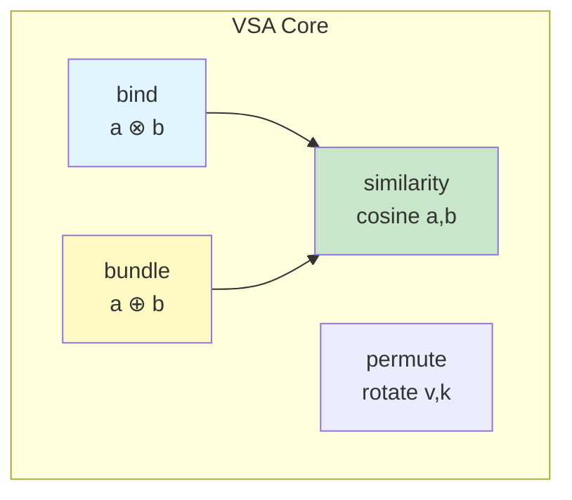

# VSA Operations Cheat Sheet

**Quick reference for Vector Symbolic Architecture operations**

---

## Core Operations Quick Reference



## Operation Summary

| Operation | Symbol | Zig Function | Complexity | Use Case |
|-----------|--------|--------------|------------|----------|
| **Bind** | `⊗` | `vsa.bind(a, b)` | O(n) | Association |
| **Unbind** | `⊗⁻¹` | `vsa.unbind(bound, key)` | O(n) | Retrieval |
| **Bundle** | `⊕` | `vsa.bundle2(a, b)` | O(n) | Combination |
| **Permute** | `ρ` | `vsa.permute(v, k)` | O(n) | Sequences |
| **Similarity** | `sim` | `vsa.cosineSimilarity(a, b)` | O(n) | Comparison |

---

## Bind (Association)

**Creates a link between two vectors**

```zig
// Create association: cat IS-AN animal
const cat_animal = vsa.bind(&cat, &animal);

// Retrieve: what is associated with cat?
const query = vsa.unbind(&cat_animal, &cat);
// query ~ animal
```

**Properties:**
- Commutative: `a ⊗ b = b ⊗ a`
- Self-inverse: `a ⊗ a = [1,1,1,...]`
- Reversible: `(a ⊗ b) ⊗ b = a`

**Use case:** Key-value pair storage, associative memory

---

## Bundle (Combination)

**Merges multiple vectors**

```zig
// Combine two vectors
const combined = vsa.bundle2(&a, &b);

// Combine three vectors
const triple = vsa.bundle3(&a, &b, &c);
```

**Properties:**
- Result is similar to both inputs
- `sim(bundle(a,b), a) > 0`
- `sim(bundle(a,b), b) > 0`
- Idempotent: `bundle(a,a) ≈ a`

**Use case:** Sets, feature accumulation

---

## Similarity

**Measures how alike two vectors are**

```zig
const sim = vsa.cosineSimilarity(&a, &b);
// Result: [-1, 1]
//   1.0  = identical
//   0.0  = orthogonal (unrelated)
//  -1.0  = opposite
```

**Interpretation table:**

| Similarity | Meaning |
|------------|---------|
| > 0.8 | Strong match |
| 0.5 - 0.8 | Good match |
| 0.3 - 0.5 | Weak match |
| < 0.3 | Unrelated |

---

## Permute (Permutation)

**Cyclic shift for encoding position**

```zig
// Shift right by 3 positions
const shifted = vsa.permute(&v, 3);

// Inverse shift
const restored = vsa.inversePermute(&shifted, 3);
```

**Use case:** Encoding sequences, positional information

---

## Common Patterns

### 1. Symbol Encoding

```zig
// Encode symbol as random vector
const symbol = vsa.HybridBigInt.random(allocator, 1000, seed);

// Encode pair: symbol1 + symbol2
const pair = vsa.bind(&symbol1, &symbol2);
```

### 2. Set Representation

```zig
// Create set from multiple elements
const set = vsa.bundle2(&elem1, &elem2);
const larger_set = vsa.bundle3(&set, &elem3, &elem4);
```

### 3. Sequence Encoding

```zig
// Encode sequence: [A, B, C]
const encoded = vsa.bundle3(
    &vsa.permute(&vecA, 0),
    &vsa.permute(&vecB, 1),
    &vsa.permute(&vecC, 2)
);
```

---

## Performance Notes

| Operation | 1000-dim | 10000-dim |
|-----------|----------|------------|
| bind | ~0.1ms | ~1ms |
| bundle2 | ~0.1ms | ~1ms |
| cosineSimilarity | ~0.05ms | ~0.5ms |
| permute | ~0.05ms | ~0.5ms |

---

## CLI Commands

```bash
# Create random vector
tri vsa-random 1000

# Compute similarity
tri vsa-sim vec1 vec2

# Bind operation
tri vsa-bind a b

# Full VSA demo
tri agents-demo
```

---

## See Also

- [VSA API Reference](/api/vsa)
- [SDK API](/api/sdk)
- [VSA Operations Tutorial](/tutorials/vsa-operations)
- [HybridBigInt Storage](/api/hybrid)

---

**φ² + 1/φ² = 3 = TRINITY**
