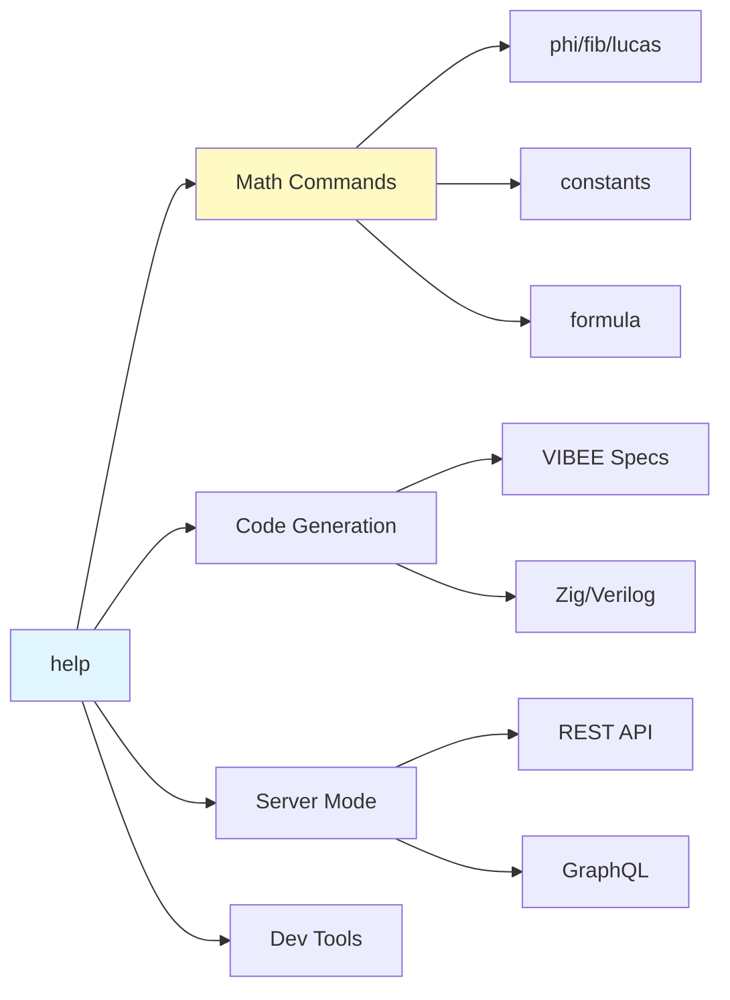

# CLI Visual Guide

Visual examples of TRI CLI commands and their output.

## Quick Reference



## Command Outputs

### tri constants

```
$ tri constants

SACRED CONSTANTS
════════════════

φ (PHI)              = 1.618033988749895
φ⁻¹ (INVERSE)        = 0.618033988749895
φ² (PHI_SQ)          = 2.618033988749895
TRINITY              = 3.000000000000000
π (PI)               = 3.141592653589793
e (E)                = 2.718281828459045

Golden Identity: φ² + 1/φ² = 3 ✓

MU (φ⁻⁴)             = 0.0381976020901013
CHI (φ⁻³)            = 0.236067977499790
SIGMA (φ)            = 1.618033988749895
EPSILON (1/3)        = 0.333333333333333
```

### tri phi 10

```
$ tri phi 10

φ¹ = 1.618033988749895
φ² = 2.618033988749895
φ³ = 4.236067977499790
φ⁴ = 6.854101966249690
φ⁵ = 11.090169943749480
φ⁶ = 17.944271909999590
φ⁷ = 29.034441853748630
φ⁸ = 46.978713763748200
φ⁹ = 76.013155617496850
φ¹⁰ = 122.991869381245050
```

### tri gen

```
$ tri gen specs/tri/todo.vibee

[VIBEE] Parsing spec: specs/tri/todo.vibee
[VIBEE] Generating Zig code...
[VIBEE] Output: trinity/output/todo.zig
[VIBEE] Generated 2 types, 4 behaviors
[VIBEE] ✓ Code generation complete
```

### tri serve

```
$ tri serve --port 8899

[TRI] Unified Server v8.27
[TRI] φ² + 1/φ² = 3 = TRINITY
[TRI]
[TRI] Starting HTTP server...
[TRI]   Host: 127.0.0.1
[TRI]   Port: 8899
[TRI]   Commands: 139 registered
[TRI]
[TRI] API endpoints:
[TRI]   GET  /api/health
[TRI]   GET  /api/version
[TRI]   GET  /api/status
[TRI]   GET  /api/commands
[TRI]   POST /api/execute
[TRI]   GET|POST /graphql
[TRI]
[TRI] ✓ Server ready at http://127.0.0.1:8899
```

### tri doctor

```
$ tri doctor

TRINITY SYSTEM HEALTH CHECK
════════════════════════════

✓ Zig 0.15.0 installed
✓ trinity library available
✓ VSA module loaded
✓ VM module loaded
✓ Firebird LLM module loaded
✓ VIBEE compiler ready

SYSTEM STATUS: HEALTHY

Modules:
  • VSA        : v0.5.0 [SIMD enabled]
  • VM         : v2.1.0 [bytecode ready]
  • Firebird   : v3.0.0 [BitNet b1.58]
  • VIBEE      : v7.0.0 [self-improving]

Performance:
  • SIMD       : ARM64 NEON ✓
  • JIT        : available
  • Memory     : 16 GB system

φ² + 1/φ² = 3 = TRINITY
```

## Color Scheme Legend

| Color | Meaning |
|-------|---------|
| 🟢 Green | Success, healthy |
| 🔵 Blue | Info, neutral |
| 🟡 Yellow | Warning, caution |
| 🔴 Red | Error, failure |
| 🟣 Purple | Sacred, special |

## Interactive Demo

```jsx live
function CLIDemo() {
  const [command, setCommand] = React.useState('constants');
  const [output, setOutput] = React.useState('');

  const commands = {
    constants: `SACRED CONSTANTS
════════════════

φ (PHI)        = 1.618033988749895
φ² (PHI_SQ)    = 2.618033988749895
TRINITY        = 3.000000000000000

Golden Identity: φ² + 1/φ² = 3 ✓`,

    phi10: `φ¹ = 1.618033988749895
φ² = 2.618033988749895
φ³ = 4.236067977499790
...
φ¹⁰ = 122.991869381245050`,

    help: `TRI Commander v8.27
Commands: 139 available

Core:
  gen        Generate code from .vibee spec
  chat       Interactive AI chat
  serve      HTTP API server
  doctor     System health check

Math:
  constants  Show sacred constants
  phi <n>    Compute φⁿ
  fib <n>    Fibonacci number
  lucas <n>  Lucas L(n)

Use 'tri help <command>' for more info.`
  };

  React.useEffect(() => {
    setOutput(commands[command] || '');
  }, [command]);

  return (
    <div style={{fontFamily: 'monospace', fontSize: '13px', background: '#1a1a2e', padding: '1rem', borderRadius: '8px'}}>
      <div style={{marginBottom: '1rem'}}>
        <label style={{color: '#888'}}>Select command: </label>
        <select
          value={command}
          onChange={(e) => setCommand(e.target.value)}
          style={{background: '#16213e', color: '#0f3460', border: '1px solid #0f3460', padding: '4px 8px', borderRadius: '4px', marginLeft: '8px'}}
        >
          <option value="constants">tri constants</option>
          <option value="phi10">tri phi 10</option>
          <option value="help">tri help</option>
        </select>
      </div>
      <pre style={{color: '#4ecca3', margin: 0, whiteSpace: 'pre-wrap'}}>{output}</pre>
    </div>
  );
}
```

## Common Patterns

### Success Pattern
```
✓ Operation completed successfully
[TRI] All checks passed
```

### Error Pattern
```
✗ Error: file not found
[TRI] Operation failed
```

### Info Pattern
```
ℹ Info: processing 10 items
[TRI] Status: in progress
```
