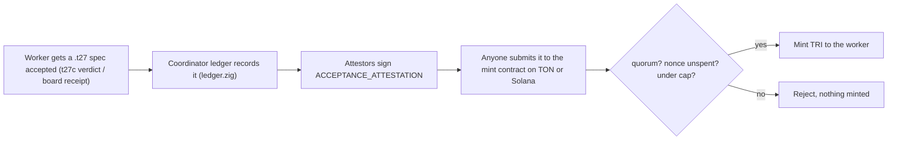

# How an accepted spec mints TRI on-chain

:::caution DESIGN ONLY -- nothing here is deployed
No contract, key, or mint exists yet. The reference code below is unaudited and
must not be deployed as written. Deployment, key custody, the security audit and
the legal review are the owner's and counsel's actions. Source of truth for the
protocol is `specs/trinet/mint_on_acceptance.t27`.
:::

## The one hard fact

A blockchain cannot run `t27c`. So the chain cannot itself check that a spec was
accepted. Every honest design is therefore about **who the chain trusts** to say
"this work was accepted," and how wrong that party can be. We make that trust
explicit and improve it in versions, rather than pretend the first version is
trustless.

Genesis minted supply is **zero**. The only way a TRI comes into existence is a
valid acceptance attestation. The cap is 3^21 and is enforced on-chain.

## The flow



## The attestation

The signed message that authorises exactly one mint:

```
ACCEPTANCE_ATTESTATION {
    worker_address   // who did the work, who gets the TRI
    work_id          // hash(accepted spec/job + its receipt) -- ties the mint to specific verified work
    chain_id         // TON or Solana; the signature is valid for one chain only
    amount_mtri      // how much, from the settlement law's reward rule
    global_nonce     // unique across BOTH chains; spent-once; blocks replay and cross-chain double-mint
    epoch            // rotation boundary for the attestor key set
}
```

Signed by **M of N attestor keys** (EIP-712 typed data on Solana/EVM; a signed
cell hash on TON). This mirrors the settlement law's own anti-replay and
anti-identity rules: a signature never decides whose account a credit belongs
in, only that a mint is authorised.

## Who the chain trusts (versioned)

| Version | Mechanism | Trust assumption | Ship? |
|---|---|---|---|
| **V1 attestor quorum** | M-of-N signatures are the only mint authority | an honest **majority** of the attestor set -- **not trustless** | build this first |
| **V2 optimistic** | posted with a bond, mints after a challenge window unless a challenger submits a fraud proof (re-runs t27c off-chain) | at least one honest challenger + a bond | next |
| **V3 receipt proof** | a succinct (zk) proof that t27c accepted / the board signed, verified on-chain | the proof system only | research |

**Say "as decentralised as its attestor set," never "trustless," for V1.** The
FPGA path may reach V3 sooner than software, because the board already signs its
result -- an on-chain check of a board signature is far cheaper than proving a
compiler run.

## Reference interfaces (unaudited, not for deployment)

TON jetton minter -- the only mint path is a verified quorum attestation:

```
;; TON minter (FunC sketch -- interface, not a deployable contract)
() recv_mint(slice attestation, slice signatures) impure {
    throw_unless(ERR_QUORUM,   check_quorum(signatures, attestation, M, N));
    throw_unless(ERR_REPLAYED, nonce_unspent(attestation.global_nonce));
    throw_unless(ERR_OVERCAP,  minted_total + attestation.amount <= CAP);
    mark_nonce_spent(attestation.global_nonce);
    minted_total += attestation.amount;
    mint_jetton_to(attestation.worker_address, attestation.amount);
}
```

Solana mint -- an SPL mint whose mint authority is a PDA that only signs inside
`mint_on_attestation`:

```rust
// Solana (Anchor sketch -- interface, not audited)
pub fn mint_on_attestation(ctx: Context<MintOnAttestation>, att: Attestation, sigs: Vec<Sig>) -> Result<()> {
    require!(verify_quorum(&sigs, &att, M, N), Err::Quorum);
    require!(!ctx.accounts.nonce_set.contains(att.global_nonce), Err::Replayed);
    require!(ctx.accounts.state.minted + att.amount <= CAP, Err::OverCap);
    ctx.accounts.nonce_set.insert(att.global_nonce);
    ctx.accounts.state.minted += att.amount;
    token::mint_to(/* authority = PDA */, att.worker_address, att.amount)?;
    Ok(())
}
```

Genesis supply is 0: neither contract mints anything in its constructor, and
neither has founder/treasury/liquidity addresses.

## The relayer

A small service turns a ledger acceptance into an on-chain mint. It holds **no
mint power** -- it only carries a message the attestors signed:

1. watch `src/trinet/ledger.zig` for a settled earning;
2. build the `ACCEPTANCE_ATTESTATION`, collect M-of-N attestor signatures;
3. submit to the chain the worker chose; retry idempotently on the `global_nonce`.

## One token on two chains

One canonical supply of **3^21**, a shared spent-nonce view across TON and Solana
so an earning cannot mint twice, and a lock-and-mint bridge to move an existing
balance between chains without minting new supply. The exact real-time
nonce-sharing mechanism is an open question in the spec -- a naive per-chain
nonce set double-mints.

## Build order

1. **V1 contracts + attestation format**, on testnets, with a throwaway attestor set. (engineering)
2. **Relayer** wired to the ledger. (engineering)
3. **Wire XP = TRI**: the Queen leaderboard reads minted balance, so a rank is a balance. (engineering)
4. **Attestor-set governance**: who holds keys, what M is, rotation. (owner decision)
5. **Bridge** for one supply across both chains. (engineering + audit)
6. **Audit + legal**, then any mainnet deploy. (gated -- owner + counsel)

Steps 1-3 are buildable now and change nothing financial. Step 6 is where real
tokens and real money begin, and it is not ours to trigger.
