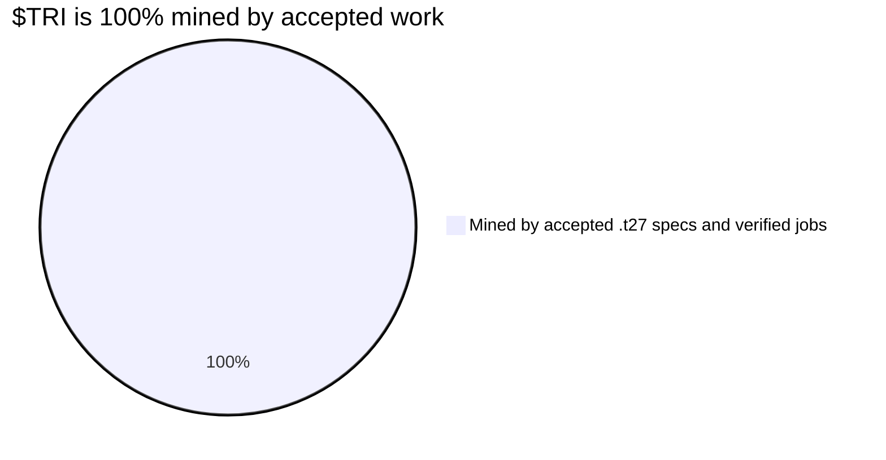

# $TRI Token Economics

$TRI is the native token of the Trinity DePIN network. It rewards node operators, governs protocol parameters, and serves as the unit of account for all on-chain operations.

## Total Supply

```
Total Supply = 3^21 = 10,460,353,203 $TRI
```

The supply is derived from the **Trinity Identity**: the number of unique states representable by 21 balanced ternary trits. This is a fixed, non-inflationary **cap on how much can ever be mined** -- not a pre-mined balance. At genesis the minted supply is **zero**. Every $TRI that will ever exist is panned by accepted work, up to this ceiling.

| Property | Value |
|----------|-------|
| Token Symbol | $TRI |
| Token Name | Trinity Token |
| Decimals | 18 |
| Total Supply | 10,460,353,203 (3^21) |
| Network | **TON** and **Solana** (multi-chain) |

## Allocation

There is no allocation. **100% of $TRI is mined by accepted work.** No founder
pre-mine, no team allocation, no treasury reserve, no pre-sale and no
pre-allocated liquidity. Every token enters circulation the same way: the Queen
accepts a `.t27` spec, or a node returns a correct receipt-backed job, and the
protocol mints the reward to whoever did the work.



| Source | Share | How it enters circulation |
|--------|-------|---------------------------|
| **Accepted work** | **100%** | Minted the instant a verifier accepts a spec or job, to the account that did it. Nothing is minted any other way. |
| Founder / team | 0% | The team earns $TRI exactly like everyone else -- by getting its own work accepted. |
| Treasury / pre-sale / liquidity | 0% | None. Development is funded by hardware sales and grants, not by the token; DEX liquidity is provided by holders of already-mined $TRI. |

It is panned, not printed: the only way to hold a $TRI is to have done work a
verifier accepted.

## Vesting

There is nothing to vest. Vesting releases pre-allocated tokens over time; with
no pre-mine and no allocation, no such balance exists. Each $TRI is minted to
the worker at the instant its work is accepted and is theirs immediately. The
`TrinityToken.sol` vesting schedule belonged to the superseded pre-allocation
model and no longer applies.

## Node Reward Emissions

The **entire 3^21 supply is mineable** and is emitted dynamically as work is
performed -- there is no pool set aside for anything else and no fixed schedule.
Rewards flow proportionally to useful, verified computation, up to the cap.

**Illustrative emission curve** (estimates, counting down from the 10,460M cap):

| Year | Estimated Emission | Cumulative mined | Remaining below cap |
|------|-------------------|------------------|---------------------|
| 1 | ~400M TRI | 400M | 10,060M |
| 2 | ~600M TRI | 1,000M | 9,460M |
| 3 | ~800M TRI | 1,800M | 8,660M |
| 4 | ~900M TRI | 2,700M | 7,760M |
| 5 | ~700M TRI | 3,400M | 7,060M |

Per-operation rates are governed by network activity and may be adjusted to
pace mining against the cap.

## Staking

Staking $TRI provides two benefits:

1. **Earnings multiplier** -- stake 100+ TRI for a 1.5x multiplier on all node earnings
2. **Governance power** -- staked tokens grant voting rights on protocol parameters (planned)

### Staking Parameters

Values from [`src/trinity_node/token_staking.zig`](https://github.com/gHashTag/trinity/blob/main/src/trinity_node/token_staking.zig):

| Parameter | Value | Source |
|-----------|-------|--------|
| Minimum Stake | **100 TRI** | `token_staking.zig:17` |
| Earnings Multiplier | **1.5x** (when staked) | `depin.zig` |
| PoS Failure Slash Rate | **1%** per failure | `token_staking.zig:19` |
| Corruption Slash Rate | **5%** per corruption event | `token_staking.zig:21` |
| Min Reputation for Staking | **0.2** (20%) | `token_staking.zig:23` |

### Staking Tiers (API Access)

Staked $TRI determines your API tier. Higher stakes unlock higher rate limits, reward multipliers, and full endpoint access. Defined in [`src/trinity_node/http_api.zig`](https://github.com/gHashTag/trinity/blob/main/src/trinity_node/http_api.zig).

| Tier | Staked $TRI | Rate Limit | Reward Multiplier | API Access |
|------|------------|------------|-------------------|------------|
| **Free** | 0 | 10 req/min | 1.0x | /health, /node/status, /metrics, /rewards/rates, /node/tier |
| **Staker** | 100+ TRI | 60 req/min | 1.5x | All endpoints |
| **Power** | 1,000+ TRI | 300 req/min | 2.0x | All endpoints + priority jobs |
| **Whale** | 10,000+ TRI | Unlimited | 3.0x | All endpoints + dedicated worker pool |

Identity is wallet-based: include your wallet address via the `X-Wallet` HTTP header. No API keys required -- your staked amount is your subscription.

### Staking Mechanics

- **Minimum stake**: 100 TRI to activate the Staker tier (1.5x earnings multiplier)
- **Reputation requirement**: Nodes must maintain a reputation score above 0.2 to remain staked
- **Slashing**: PoS failures lose 1% of stake; data corruption loses 5% of stake
- **Compounding**: Rewards can be re-staked to increase the staking balance

:::note Planned Features
The following features are designed but not yet implemented in the node software:
- **Lock period**: 7 days minimum (planned)
- **Unstaking cooldown**: 7-day cooldown period (planned)
- **Governance tiers**: Tiered voting power based on stake amount (planned)
:::

## Contract Address

:::caution Testnet Only
$TRI is a real, transferable token. Chains of record are **TON** (Telegram distribution: Mini Apps, TON Connect, @wallet) and **Solana** (deep DEX liquidity), with one canonical 3^21 supply mirrored across both by a lock-and-mint bridge. The Ethereum Sepolia contract below was the original testnet proof of concept and is superseded as a chain of record; it stays only as a testnet artefact. The reasoning that moved TRI from a non-transferable credit to a transferable token, and what a compliant issuance still requires, is recorded in `specs/trinet/settlement_law.t27` under finding `ISSUANCE_AT_SMALL_N`.
:::

| Chain | Status / address |
|---------|---------|
| TON | chain of record -- not yet deployed |
| Solana | chain of record -- not yet deployed |
| Ethereum Sepolia (testnet PoC, superseded) | [`0xef368e29FA3aB2eaf02BccD05438ED3bafE9f469`](https://sepolia.etherscan.io/address/0xef368e29FA3aB2eaf02BccD05438ED3bafE9f469) |

## Governance

$TRI holders with staked tokens can vote on:

| Parameter | Current Value | Governance Range |
|-----------|--------------|-----------------|
| VSA Evolution reward rate | 0.001 TRI | 0.0001 -- 0.01 TRI |
| Navigation reward rate | 0.0001 TRI | 0.00001 -- 0.001 TRI |
| WASM Conversion reward rate | 0.01 TRI | 0.001 -- 0.1 TRI |
| Benchmark reward rate | 0.005 TRI | 0.0005 -- 0.05 TRI |
| Storage Hosting rate | 0.00005 TRI | 0.000005 -- 0.0005 TRI |
| Storage Retrieval rate | 0.0005 TRI | 0.00005 -- 0.005 TRI |
| Staking minimum | 100 TRI | 10 -- 10,000 TRI |
| PoS failure slash rate | 1% | 0.1% -- 10% |
| Corruption slash rate | 5% | 1% -- 25% |

Governance proposals require a quorum of 5% of staked supply and a simple majority to pass.

## Next Steps

- [Rewards](./rewards.md) -- detailed reward rates and bonus multipliers
- [Quick Start](./quickstart.md) -- start earning $TRI now
- [Architecture](./architecture.md) -- how the network secures the token economy
