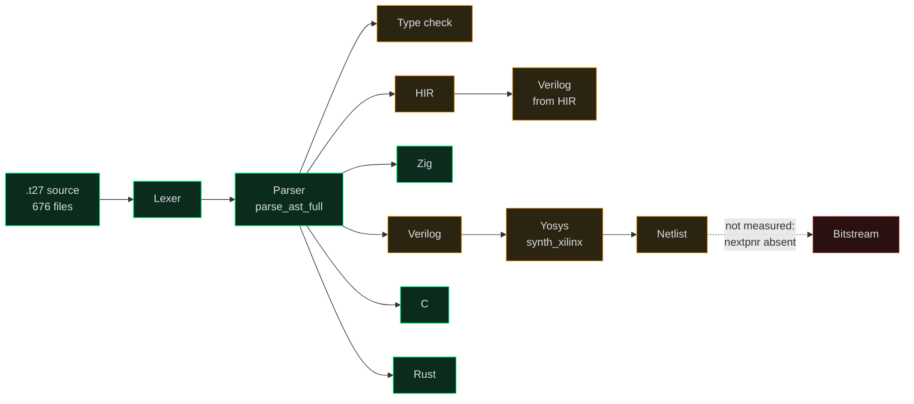
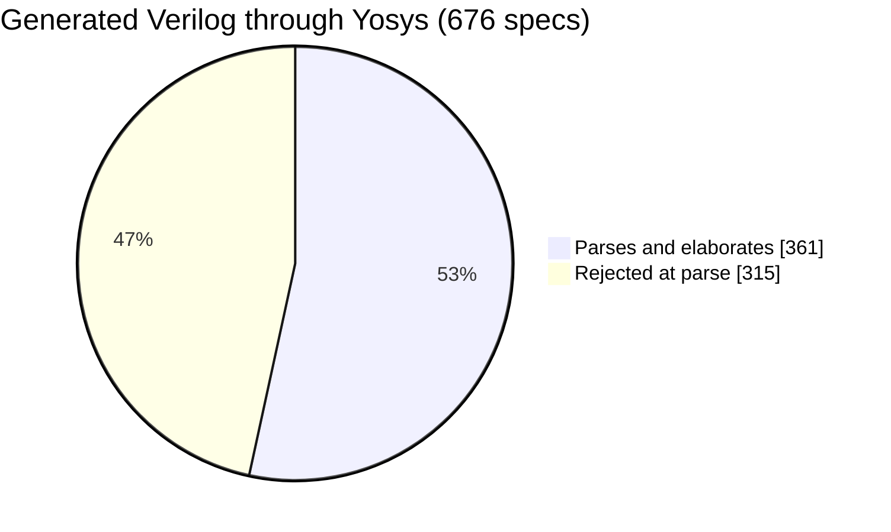

# The spec corpus, measured

Every number on this page came from running the tools, not from reading the
code. The compiler is `bootstrap/src/compiler.rs`; the synthesiser is Yosys
0.63 targeting Artix-7. Where a number is missing, it says so rather than
guessing.

## The pipeline



The dashed edge is the honest part: place-and-route was **not** measured,
because `nextpnr-xilinx` is not installed on the machine that produced these
numbers. Nothing below claims a bitstream.

## Corpus health

Every spec is counted once, at its worst stage, so the three add up to the
total. Counts that do not reconcile are how a health page loses its reader.

<div style={{fontFamily: 'ui-monospace, monospace', fontSize: '0.9rem'}}>

| State | Count | Meaning |
|---|---:|---|
| Clean | **522** | every layer, no complaints |
| Warnings | **235** | compiles, but something was dropped or flagged |
| Broken | **3** | a backend refused outright |
| **Total** | **760** | across 5 repositories |

</div>

<svg viewBox="0 0 100 4" preserveAspectRatio="none" style={{width: '100%', height: '10px', borderRadius: '5px', overflow: 'hidden'}} role="img" aria-label="522 clean, 235 warnings, 3 broken">
  <rect x="0" y="0" width="68.7" height="4" fill="#00FF88" />
  <rect x="68.7" y="0" width="30.9" height="4" fill="#f0a020" />
  <rect x="99.6" y="0" width="0.4" height="4" fill="#f85149" />
</svg>

:::note Why 760 here and 676 below
The health figures cover the whole vendored corpus (5 repositories, after
content-hash de-duplication). The synthesis sweep ran over one checkout, 676
files. Different denominators, stated rather than blended.
:::

## Synthesis

Yosys 0.63, `synth_xilinx -nodsp`, over the Verilog each spec generates.



And then the result that matters:

<div style={{fontFamily: 'ui-monospace, monospace', fontSize: '0.9rem'}}>

| Metric | Value |
|---|---:|
| Specs whose Verilog Yosys accepts | 361 |
| Total LUTs across all of them | **0** |
| Total flip-flops | **0** |
| Typical cell count per spec | 4–8 (`IBUF` / `OBUF` only) |
| Estimated logic cells | **0** |

</div>

`chips/euler/specs/fpga/int4.t27` is representative: 4 cells, being 3 `IBUF`
and 1 `OBUF`, for the `clk` / `rst_n` / `en` inputs and the `ready` output.
Ports, and nothing behind them.

**The `.t27` → Verilog path currently emits module shells, not hardware.**

:::caution That zero was earned
The first run of this sweep reported "361 synthesised, 0 cells, 0 LUTs" and it
was *wrong* — `yosys -q` suppresses the `stat` report entirely, so the tool was
gagged rather than the designs empty. The counts are also printed count-first
(`8   LUT2`), so a name-then-count regex matched nothing even when the report
was present. Two independent ways to read zero, neither about the corpus.

`synth_sweep.mjs` now synthesises a known-good adder first and **refuses to
measure anything** unless it returns non-zero (24 LUTs, 27 FFs). A zero is only
evidence once something known-nonzero has proved the instrument can see.
:::

### Why the other 315 fail

Grouped by cause rather than by filename — 315 paths are a list, nine causes
are a finding:

<div style={{fontFamily: 'ui-monospace, monospace', fontSize: '0.85rem'}}>

| Cause | Share of sample |
|---|---:|
| `syntax error, unexpected '.'` | 7 |
| `syntax error, unexpected '@'` | 6 |
| `syntax error, unexpected TOK_PRIMITIVE` | 4 |
| `syntax error, unexpected ')'` | 3 |
| `syntax error, unexpected TOK_ID` | 3 |
| other single-instance shapes | 2 |

</div>

These are the first 25 failures the sweep recorded, not all 315 — the sweep
caps the failure list it reports. The shape is consistent enough to act on;
the exact distribution over all 315 is not claimed.

## What runs on real silicon

Separately, and worth not conflating: the working bitstreams in this project
are **hand-written RTL**, not spec codegen. One was flashed to the board while
these measurements were taken.

<div style={{fontFamily: 'ui-monospace, monospace', fontSize: '0.9rem'}}>

| | |
|---|---|
| Board | ALINX AX7203, `xc7a200tfbg484-2` |
| JTAG IDCODE | `0x13636093` |
| Bitstream | `gf8_clean_ax7203.bit`, 9,730,789 bytes |
| Flash time | **778.776 s** at 100 kHz |
| Prior measurement, same board | 778.755 s |

</div>

Two flashes of comparable images landing within 0.02 s of each other is the
reason the 13-minute figure is quoted as a budget rather than an estimate.

<div className="t27-pipeline-anim">
  <svg viewBox="0 0 720 60" role="img" aria-label="Animated diagram: source flows through the compiler stages into a netlist, with place and route greyed out">
    <defs>
      <marker id="t27arrow" viewBox="0 0 10 10" refX="9" refY="5" markerWidth="5" markerHeight="5" orient="auto-start-reverse">
        <path d="M 0 0 L 10 5 L 0 10 z" fill="#3d4a44" />
      </marker>
    </defs>
    <line x1="70" y1="30" x2="640" y2="30" stroke="#3d4a44" strokeWidth="1.5" markerEnd="url(#t27arrow)" />
    <circle className="t27-pulse" cx="70" cy="30" r="4" fill="#00FF88" />
    {[['70','source'],['210','AST'],['350','Verilog'],['490','netlist'],['630','bitstream']].map(([x, label], i) => (
      <g key={label}>
        <circle cx={x} cy="30" r="5" fill={i === 4 ? '#2b1010' : '#0b2b1c'} stroke={i === 4 ? '#f85149' : '#00FF88'} strokeWidth="1.5" />
        <text x={x} y="52" textAnchor="middle" fontSize="10" fill={i === 4 ? '#f85149' : '#8b9490'} fontFamily="ui-monospace, monospace">{label}</text>
      </g>
    ))}
  </svg>
</div>

## Reproducing this

```bash
cd bindings/wasm-explorer
cargo build --target wasm32-unknown-unknown --release
node scan.mjs          # every layer, per spec
node synth_sweep.mjs   # yosys over the generated Verilog
```

`synth_sweep.mjs` prints its self-check first. If that line does not appear, do
not trust the numbers that follow it.

## Browse it interactively

Every spec on this page is at [t27.ai/#/specs](https://t27.ai/#/specs), running
the same compiler in the browser — edit any spec and watch the numbers move.
