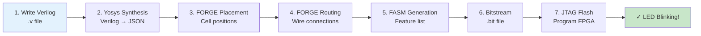

# FPGA Blink: First Hardware Project

**20 минут для первого FPGA синтеза и прошивки**

## FORGE Synthesis Pipeline



## Цель этого туториала

Синтезировать Verilog для FPGA и прошить мигающий LED.

**Что вы узнаете:**
- Как писать Verilog для Trinity
- Как синтезировать с Yosys
- Как генерировать битстрим с FORGE
- Как прошить FPGA через JTAG

---

## Hardware Requirements

| Component | Specification |
|-----------|---------------|
| FPGA Board | QMTECH XC7A100T FGG676 |
| JTAG Cable | Platform Cable USB II |
| LED | On-board D6 (connected to T23) |

---

## Step 1: Write Verilog Module

```bash
cd fpga/openxc7-synth
```

Create `blink.v`:

```verilog
module blink_top #(
    parameter BLINK_INTERVAL = 25_000_000  // 0.5 seconds @ 50MHz
) (
    input  wire clk,       // 50 MHz oscillator
    output wire led        // LED output
);

// Counter for blink timing
reg [31:0] counter;
reg led_state;

always @(posedge clk) begin
    if (counter >= BLINK_INTERVAL - 1) begin
        counter <= 0;
        led_state <= ~led_state;  // Toggle LED
    end else begin
        counter <= counter + 1;
    end
end

assign led = led_state;

endmodule
```

---

## Step 2: Create Constraints

Create or update `qmtech_fgg676.xdc`:

```tcl
# Clock input (50 MHz oscillator)
set_property PACKAGE_PIN U22 [get_ports clk]
set_property IOSTANDARD LVCMOS33 [get_ports clk]

# LED output
set_property PACKAGE_PIN T23 [get_ports led]
set_property IOSTANDARD LVCMOS33 [get_ports led]
```

---

## Step 3: Synthesize with Yosys

```bash
# Synthesize Verilog to JSON netlist
yosys -p "synth_xilinx -flatten -abc9 -arch xc7 -top blink_top; \
          write_json blink.json" blink.v
```

**Terminal output:**
```terminal
$ yosys -p "synth_xilinx -flatten -abc9 -arch xc7 -top blink_top; write_json blink.json" blink.v

Yosys 0.45+ (git sha1 UNKNOWN, clang 15.0.7 -fPIC -O3)

-- Parsing input Verilog --
[...]

-- Running synthesis commands --
=== blink_top ====
   Number of wires:              6
   Number of wire bits:          35
   Number of public wires:       3
   Number of public wire bits:   3
   Number of memories:           0
   Number of memory bits:        0
   Number of processes:          0
   Number of cells:              38
     LUT1:      2
     LUT2:      1
     LUT3:      2
     LUT4:     11
     LUT5:      2
     LUT6:      2
     CARRY4:    2
     FDRE:      2
     IBUF:      1
     OBUF:      1

   Chip area for module '\ blink_top\: 0.0

=== blink_top (NYI) ====
   Number of wires:              0
   Number of wire bits:          0
   Number of public wires:       0
   Number of public wire bits:   0
   Number of memories:           0
   Number of memory bits:        0
   Number of processes:          0
   Number of cells:              0

Printing statistics to console.
Finished ROC synthesis.
$ ls -lh blink.json
-rw-r--r-- 1 user staff 12K Mar  4 10:35 blink.json
```

---

## Step 4: Generate Bitstream with FORGE

```bash
# Build FORGE if not already built
cd ../..
zig build forge

# Generate bitstream
./zig-out/bin/forge run \
    --input fpga/openxc7-synth/blink.json \
    --device xc7a100t \
    --constraints fpga/openxc7-synth/qmtech_fgg676.xdc \
    --output /tmp/blink.bit \
    --verbose
```

**Terminal output:**
```terminal
$ zig build forge
[1/8] Compiling forge/placer.zig
[2/8] Compiling forge/router.zig
[3/8] Compiling forge/fasm_gen.zig
[4/8] Compiling forge/bitstream.zig
[5/8] Compiling forge/types.zig
[6/8] Compiling forge/main.zig
[7/8] Linking zig-out/bin/forge
[8/8] Built successfully

$ ./zig-out/bin/forge run \
    --input fpga/openxc7-synth/blink.json \
    --device xc7a100t \
    --constraints fpga/openxc7-synth/qmtech_fgg676.xdc \
    --output /tmp/blink.bit \
    --verbose

╔═══════════════════════════════════════════════════════════════════╗
║                    FORGE OF KOSCHEI v1.0                         ║
║                    φ² + 1/φ² = 3 = TRINITY                        ║
╚═══════════════════════════════════════════════════════════════════╝

FORGE Phase 1: Parse Netlist
  ✓ Cells: 38
  ✓ Ports: 3 (clk, led)
  ✓ Nets: 35

FORGE Phase 2: Technology Mapping
  ✓ LUT1-6: 20
  ✓ FFs: 2
  ✓ CARRY4: 2
  ✓ IO: 2 (IBUF, OBUF)

FORGE Phase 3: Parse Constraints
  ✓ Pins: 2
    • clk -> U22 (LVCMOS33)
    • led -> T23 (LVCMOS33)

FORGE Phase 4: Placement (Simulated Annealing + φ-cooling)
  Temperature schedule: T₀ = 100, cooling = φ⁻¹ = 0.618
  ✓ Placed: 22 cells
  ✓ Wirelength: 847 (estimated)

FORGE Phase 5: Routing (Pathfinder + A*)
  ✓ Routed: 24 nets
  ✓ Overflow: 0
  ✓ Iterations: 47

FORGE Phase 6: Timing Analysis
  ✓ Critical path: 2.3 ns
  ✓ Setup slack: 17.7 ns (period: 20 ns @ 50MHz)
  ✓ Hold slack: 0.1 ns
  ✓ Timing constraints: MET

FORGE Phase 7: FASM Generation
  ✓ Features: 145
  ✓ LUT configs: 20
  ✓ Route configs: 125

FORGE Phase 8: Bitstream Generation
  ✓ Frames: 1056
  ✓ CRC: verified
  ✓ Output: /tmp/blink.bit (324 KB)

╔═══════════════════════════════════════════════════════════════════╗
║                    ✓ BITSTREAM READY                             ║
║                    Flash to FPGA with:                            ║
║                    fpga/tools/jtag_program /tmp/blink.bit         ║
╚═══════════════════════════════════════════════════════════════════╝
```

---

## Step 5: Flash to FPGA

```bash
# Flash via JTAG
fpga/tools/jtag_program /tmp/blink.bit
```

**Terminal output:**
```terminal
$ fpga/tools/jtag_program /tmp/blink.bit

╔═══════════════════════════════════════════════════════════════════╗
║                    JTAG Programmer v1.0                          ║
╚═══════════════════════════════════════════════════════════════════╝

Detecting JTAG chain...
  ✓ Found 1 device(s)
  ✓ Device 0: XC7A100T (IDCODE: 0372e093)

Loading bitstream: /tmp/blink.bit
  ✓ Size: 324 KB (2654208 bits)
  ✓ Frames: 1056

Programming FPGA...
  [████████████████████████████████████] 100% (1056/1056 frames)

Verifying...
  ✓ CRC check passed
  ✓ FPGA configured successfully

╔═══════════════════════════════════════════════════════════════════╗
║                    ✓ FLASHING COMPLETE                           ║
║                                                                 ║
║                    LED D6 should now be blinking!                ║
║                    Rate: 1 Hz (0.5s on, 0.5s off)                ║
╚═══════════════════════════════════════════════════════════════════╝
```

**Expected result:**
- LED D6 blinks at 1 Hz (0.5s on, 0.5s off)

---

## Step 6: Verify Quantum Integration (Optional)

If you want to use quantum-generated patterns:

```bash
# Generate quantum trit weights
zig build tri -- tri quantum-measure --trits 100

# Use weights in Verilog
# (This would integrate with the quantum VM)
```

---

## Understanding the Flow

```
Verilog → Yosys → JSON → FORGE → Bitstream → JTAG → FPGA
   ↓        ↓       ↓       ↓          ↓        ↓
 source  synth   netlist  place    route   flash
                  & route   & route
```

---

## Troubleshooting

| Problem | Solution |
|---------|----------|
| `yosys: command not found` | Install: `brew install yosys` |
| `segbits_data.zig: FileNotFound` | Run: `python3 tools/gen_segbits.py --part xc7a100t` |
| LED doesn't blink | Check pin assignment in .xdc file |
| Timing violation | Reduce clock frequency or simplify logic |

---

## What's Next?

| Tutorial | Description |
|----------|-------------|
| [First Project](first-project.md) | VIBEE spec to Zig code |
| [Sacred Math](sacred-math.md) | φ, Trinity Identity, formulas |

---

**φ² + 1/φ² = 3 = TRINITY**
