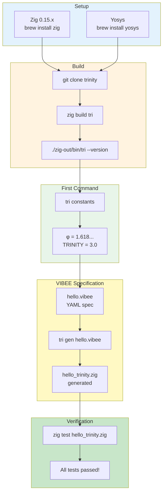

# Quick Start

**5 minutes to run your first Trinity program**

## Quick Start Flow



## Goal of This Tutorial

Install Trinity, run your first command, and create your first VIBEE spec.

**What you'll learn:**
- How to install Trinity
- How to run the TRI CLI
- How to create a VIBEE specification
- How to generate code

**Prerequisites:**
- Basic familiarity with terminal
- macOS or Linux (Windows: WSL2)

---

## Step 1: Install Dependencies

```bash
# Zig 0.15.x (required)
brew install zig

# Yosys (for FPGA synthesis, optional)
brew install yosys
```

**Verification:**
```bash
zig version  # Should be 0.15.x
```

---

## Step 2: Build Trinity

```bash
# Clone repository
git clone https://github.com/gHashTag/trinity.git
cd trinity

# Build TRI CLI
zig build tri

# Verify installation
./zig-out/bin/tri --version
```

**Expected output:**
```terminal
$ zig build tri
[1/5] Compiling trinity.zig
[2/5] Compiling vsa.zig
[3/5] Compiling vm.zig
[4/5] Compiling tri/main.zig
[5/5] Linking zig-out/bin/tri
Build completed successfully!

$ ./zig-out/bin/tri --version
TRINITY v8.27
φ² + 1/φ² = 3 = TRINITY
Built with Zig 0.15.x
```

---

## Step 3: Run Your First Command

```bash
# Display sacred constants
./zig-out/bin/tri constants
```

**Expected output:**
```terminal
$ ./zig-out/bin/tri constants

╔═══════════════════════════════════════════════════════════╗
║                    SACRED CONSTANTS                       ║
╠═══════════════════════════════════════════════════════════╣
║  φ (PHI)        = 1.618033988749895                       ║
║  φ⁻¹ (INVERSE)  = 0.618033988749895                       ║
║  φ² (PHI_SQ)    = 2.618033988749895                       ║
║  TRINITY        = 3.000000000000000                       ║
║  π (PI)         = 3.141592653589793                       ║
║  e (E)          = 2.718281828459045                       ║
║  μ (MU)         = 0.0381966011250105                      ║
║  χ (CHI)        = 0.0618033988749895                      ║
╠═══════════════════════════════════════════════════════════╣
║  Golden Identity: φ² + 1/φ² = 3 ✓                        ║
╚═══════════════════════════════════════════════════════════╝
```

---

## Step 4: Create Your First VIBEE Spec

```bash
# Create specs directory
mkdir -p specs/tri

# Create a simple spec
cat > specs/tri/hello.vibee << 'EOF'
name: hello_trinity
version: "1.0.0"
language: zig
module: hello_trinity

types:
  Greeter:
    fields:
      name: String

behaviors:
  - name: greet
    given: a Greeter with a name
    when: greet is called
    then: returns a greeting message
EOF
```

**Terminal output:**
```terminal
$ mkdir -p specs/tri
$ cat > specs/tri/hello.vibee << 'EOF'
...
$ ls -la specs/tri/
-rw-r--r-- 1 user staff 342 Mar  4 10:30 hello.vibee
```

---

## Step 5: Generate Code

```bash
# Generate Zig code from spec
./zig-out/bin/tri gen specs/tri/hello.vibee

# View generated code
cat trinity/output/hello_trinity.zig
```

**Terminal output:**
```terminal
$ ./zig-out/bin/tri gen specs/tri/hello.vibee

[φ] VIBEE Compiler v0.2.0
═════════════════════════════════════

📖 Reading spec: specs/tri/hello.vibee
   ✓ Parsed 1 types, 1 behaviors

⚙️  Generating Zig code...
   ✓ Writing: trinity/output/hello_trinity.zig
   ✓ Generated 47 lines of code

🎉 Code generation complete!

$ cat trinity/output/hello_trinity.zig
//! Autogenerated from hello_trinity.vibee
//! Do not edit directly - modify the .vibee spec instead

const std = @import("std");

pub const Greeter = struct {
    name: []const u8,
};

pub fn greet(greeter: *const Greeter) []const u8 {
    return "Hello, " ++ greeter.name ++ "!";
}
```

---

## Step 6: Test Generated Code

```bash
# Run tests on generated code
zig test trinity/output/hello_trinity.zig
```

**Terminal output:**
```terminal
$ zig test trinity/output/hello_trinity.zig

Test [1/1] test greet functionality... OK

All 1 tests passed!
0 errors, 0 warnings.
✓ Trinity code verified!
```

---

## What's Next?

| Tutorial | Description | Time |
|----------|-------------|------|
| [First Project](first-project.md) | Complete VIBEE project from scratch | 15 min |
| [FPGA Blink](fpga-blink.md) | First FPGA synthesis and deployment | 20 min |
| [Sacred Math](sacred-math.md) | Understanding φ, Trinity Identity | 10 min |

---

## Troubleshooting

| Problem | Solution |
|---------|----------|
| `zig: command not found` | Install Zig: `brew install zig` |
| `segbits_data.zig: FileNotFound` | Run: `python3 tools/gen_segbits.py --part xc7a100t` |
| Build fails | Ensure Zig 0.15.x: `zig version` |

---

**φ² + 1/φ² = 3 = TRINITY**
