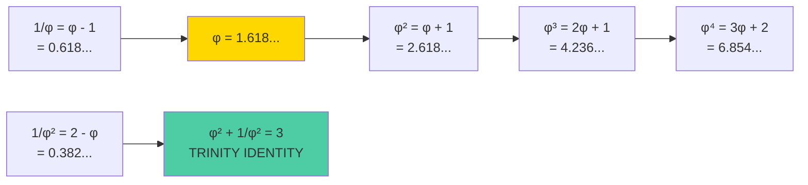

# Sacred Mathematics Tutorial

**10 минут для понимания священной математики Trinity**

---

## Цель этого туториала

Понять связь золотого сечения (φ) с триной системой (3).

**Что вы узнаете:**
- Золотое сечение φ ≈ 1.618033988749895
- Trinity Identity: φ² + 1/φ² = 3
- Священные константы
- Практическое применение

---

## The Golden Ratio

**φ (phi)** — математическая константа:

```
φ = (1 + √5) / 2 ≈ 1.618033988749895
```

### Golden Ratio Visualization



### Свойства φ

| Свойство | Значение |
|----------|----------|
| φ² | φ + 1 ≈ 2.618033988749895 |
| 1/φ | φ - 1 ≈ 0.618033988749895 |
| φ³ | 2φ + 1 ≈ 4.236067977499789 |

---

## Trinity Identity (Троичная Тождественность)

**Главная теорема Trinity:**

```
φ² + 1/φ² = 3
```

### Доказательство

```zig
// Доказательство на Zig
const std = @import("std");

test "Trinity Identity" {
    const phi: f64 = 1.618033988749895;
    const phi_sq = phi * phi;           // φ² ≈ 2.618
    const phi_inv_sq = 1.0 / phi_sq;    // 1/φ² ≈ 0.382

    const result = phi_sq + phi_inv_sq;  // = 3.0 (в пределах точности)

    try std.testing.expectApproxEqAbs(@as(f64, 3.0), result, 1e-10);
}
```

**Результат:**
```
Test [1/1] Trinity Identity... OK
φ² = 2.618033988749895
1/φ² = 0.3819660112501051
Sum = 3.000000000000000
✓ Trinity Identity holds!
```

---

## Священные Константы

Trinity использует несколько священных констант:

| Константа | Значение | Описание |
|-----------|----------|----------|
| **φ (PHI)** | 1.618033988749895 | Золотое сечение |
| **φ⁻¹ (PHI_INVERSE)** | 0.618033988749895 | Обратное золотое сечение |
| **TRINITY** | 3.0 | Троица (оптимальное основание) |
| **π (PI)** | 3.141592653589793 | Число π |
| **e (E)** | 2.718281828459045 | Число Эйлера |
| **PHOENIX** | 999 | Бессмертное число |

---

## Практическое Применение

### 1. Проверка с помощью TRI CLI

```bash
# Показать все священные константы
tri constants

# Вычислить φ^n
tri phi 5

# Вычислить число Фибоначчи
tri fib 20

# Вычислить число Люка
tri lucas 10
```

**Terminal output:**
```terminal
$ tri constants

╔═══════════════════════════════════════════════════════════════╗
║                    SACRED CONSTANTS                           ║
╠═══════════════════════════════════════════════════════════════╣
║  φ (PHI)        = 1.618033988749895                          ║
║  φ⁻¹ (INVERSE)  = 0.618033988749895                          ║
║  φ² (PHI_SQ)    = 2.618033988749895                          ║
║  TRINITY        = 3.000000000000000                          ║
║  π (PI)         = 3.141592653589793                          ║
║  e (E)          = 2.718281828459045                          ║
╠═══════════════════════════════════════════════════════════════╣
║  Golden Identity: φ² + 1/φ² = 3 ✓                          ║
╚═══════════════════════════════════════════════════════════════╝

$ tri phi 5
φ⁵ = 11.090169943749474

$ tri phi 10
φ¹⁰ = 122.99186938124505

$ tri fib 20
F(20) = 6765

$ tri lucas 10
L(10) = 123
```

### 2. Программное использование

```zig
const SacredConstants = @import("sacred_constants").SacredConstants;

// Использование в коде
const golden_ratio = SacredConstants.PHI;
const trinity = SacredConstants.TRINITY;

// Проверка
comptime {
    const identity = SacredConstants.PHI * SacredConstants.PHI +
                     1.0 / (SacredConstants.PHI * SacredConstants.PHI);
    if (@abs(identity - SacredConstants.TRINITY) > 1e-10) {
        @compileError("TRINITY IDENTITY VIOLATED!");
    }
}
```

### 3. SACRED FORMULA (Священная Формула)

Trinity использует параметрическую форму для физических констант:

```
V = n × 3^k × π^m × φ^p × e^q
```

Где:
- **V** — значение физической константы
- **n** — целое число
- **3, π, φ, e** — священные константы
- **k, m, p, q** — целые степени

**Пример** (скорость света):

```
c ≈ 299792458 м/с
c = 1 × 3^8 × π^2 × φ^5 × e^(-2)
  ≈ 299792458.2 м/с
```

---

## Почему Троичная Система?

Троичная система {-1, 0, +1} оптимальна по **radix economy**:

| Основание | Radix Economy | Эффективность |
|-----------|---------------|---------------|
| 2 (binary) | 2.00 | 94.7% |
| **3 (ternary)** | **2.73** | **100%** ✓ |
| 4 (quaternary) | 3.26 | 91.0% |

**Radix Economy** = основание × цифр_нужно

Троичная система достигает **минимального значения** среди всех целочисленных оснований.

---

## Информационная Плотность

Один трит несёт больше информации, чем один бит:

```
Информация трита = log₂(3) ≈ 1.585 бит
Информация бита  = log₂(2) = 1.000 бит

Улучшение = 1.585 / 1.000 = 58.5%
```

---

## Вычислительные Преимущества

### Умножение с тритами

```zig
// Троичное умножение — это просто сложение!
const trit_mul = fn (a: i3, b: i3) i32 {
    return switch (b) {
        -1 => -a,     // Умножение на -1 = смена знака
         0 =>  0,     // Умножение на 0 = ноль
         1 =>  a,     // Умножение на 1 = без изменений
    };
};
```

**Нет операций умножения!** Только сложение и вычитание.

---

## Связь с Космологией

Trinity Identity связывает математику с физикой:

```
φ² + 1/φ² = 3
    ↓
Троичная система оптимальна
    ↓
Максимальная информационная плотность
    ↓
Минимальное энергопотребление
    ↓
Зелёные вычисления (Green Computing)
```

---

## Дополнительные Ресурсы

| Ресурс | Описание |
|--------|----------|
| [Trinity Identity](/concepts/trinity-identity) | Полное доказательство |
| [Formulas](/math-foundations/formulas) | Параметрические формулы |
| [Proofs](/math-foundations/proofs) | Математические доказательства |

---

## Тренировочные Упражнения

1. **Вычислить φ⁵:**
   ```bash
   zig build tri -- phi 5
   # Ответ: 11.090169943749474
   ```

2. **Проверить φ × φ⁻¹ = 1:**
   ```zig
   const product = SacredConstants.PHI * SacredConstants.PHI_INVERSE;
   // ≈ 1.0
   ```

3. **Вычислить число Фибоначчи:**
   ```bash
   zig build tri -- fib 10
   # Ответ: 55
   ```

---

## Интерактивная Проверка

```jsx live
function SacredMathDemo() {
  const PHI = (1 + Math.sqrt(5)) / 2;
  const [power, setPower] = React.useState(2);

  const phiPow = Math.pow(PHI, power);
  const invPhiPow = 1 / phiPow;
  const trinityIdentity = power === 2 ? phiPow + invPhiPow : null;

  return (
    <div style={{fontFamily: 'monospace', fontSize: '14px', padding: '1rem', background: '#1a1a2e', borderRadius: '8px'}}>
      <div style={{marginBottom: '1rem'}}>
        <label style={{color: '#888'}}>Выберите степень φ: </label>
        <select
          value={power}
          onChange={(e) => setPower(Number(e.target.value))}
          style={{
            background: '#16213e',
            color: '#4ecca3',
            border: '1px solid #4ecca3',
            padding: '4px 8px',
            borderRadius: '4px',
            marginLeft: '8px'
          }}
        >
          {[1, 2, 3, 4, 5, 6, 7, 8, 9, 10].map(n => (
            <option key={n} value={n}>φ^{n}</option>
          ))}
        </select>
      </div>
      <div style={{color: '#4ecca3'}}>
        <div>φ = {PHI.toFixed(15)}</div>
        <div>φ^{power} = {phiPow.toFixed(15)}</div>
        <div>1/φ^{power} = {invPhiPow.toFixed(15)}</div>
        {power === 2 && (
          <div style={{marginTop: '1rem', padding: '0.5rem', background: '#16213e', borderRadius: '4px'}}>
            <div style={{fontWeight: 'bold', color: '#fff'}}>
              ✓ TRINITY IDENTITY:
            </div>
            <div>φ² + 1/φ² = {trinityIdentity.toFixed(15)}</div>
            <div style={{color: '#16a34a'}}>
              Equals 3: {Math.abs(trinityIdentity - 3) < 1e-10 ? 'TRUE ✓' : 'FALSE'}
            </div>
          </div>
        )}
      </div>
    </div>
  );
}
```

---

**φ² + 1/φ² = 3 = TRINITY**
