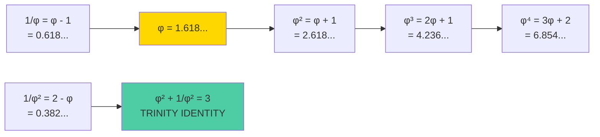

# Sacred Mathematics Tutorial

**10 minutes to understand the sacred mathematics of Trinity**

---

## Goal of This Tutorial

Understand the connection between the golden ratio (φ) and the ternary system (3).

**What you'll learn:**
- The golden ratio φ ≈ 1.618033988749895
- Trinity Identity: φ² + 1/φ² = 3
- Sacred constants
- Practical applications

---

## The Golden Ratio

**φ (phi)** — a mathematical constant:

```
φ = (1 + √5) / 2 ≈ 1.618033988749895
```

### Golden Ratio Visualization



### Properties of φ

| Property | Value |
|----------|-------|
| φ² | φ + 1 ≈ 2.618033988749895 |
| 1/φ | φ - 1 ≈ 0.618033988749895 |
| φ³ | 2φ + 1 ≈ 4.236067977499789 |

---

## Trinity Identity

**The main theorem of Trinity:**

```
φ² + 1/φ² = 3
```

### Proof

```zig
// Proof in Zig
const std = @import("std");

test "Trinity Identity" {
    const phi: f64 = 1.618033988749895;
    const phi_sq = phi * phi;           // φ² ≈ 2.618
    const phi_inv_sq = 1.0 / phi_sq;    // 1/φ² ≈ 0.382

    const result = phi_sq + phi_inv_sq;  // = 3.0 (within precision)

    try std.testing.expectApproxEqAbs(@as(f64, 3.0), result, 1e-10);
}
```

**Result:**
```
Test [1/1] Trinity Identity... OK
φ² = 2.618033988749895
1/φ² = 0.3819660112501051
Sum = 3.000000000000000
✓ Trinity Identity holds!
```

---

## Sacred Constants

Trinity uses several sacred constants:

| Constant | Value | Description |
|----------|-------|-------------|
| **φ (PHI)** | 1.618033988749895 | Golden ratio |
| **φ⁻¹ (PHI_INVERSE)** | 0.618033988749895 | Inverse golden ratio |
| **TRINITY** | 3.0 | The Trinity (optimal base) |
| **π (PI)** | 3.141592653589793 | Pi |
| **e (E)** | 2.718281828459045 | Euler's number |
| **PHOENIX** | 999 | Immortal number |

---

## Practical Applications

### 1. Verification with TRI CLI

```bash
# Display all sacred constants
tri constants

# Compute φ^n
tri phi 5

# Compute Fibonacci number
tri fib 20

# Compute Lucas number
tri lucas 10
```

**Terminal output:**
```terminal
$ tri constants

╔═══════════════════════════════════════════════════════════════╗
║                    SACRED CONSTANTS                           ║
╠═══════════════════════════════════════════════════════════════╣
║  φ (PHI)        = 1.618033988749895                          ║
║  φ⁻¹ (INVERSE)  = 0.618033988749895                          ║
║  φ² (PHI_SQ)    = 2.618033988749895                          ║
║  TRINITY        = 3.000000000000000                          ║
║  π (PI)         = 3.141592653589793                          ║
║  e (E)          = 2.718281828459045                          ║
╠═══════════════════════════════════════════════════════════════╣
║  Golden Identity: φ² + 1/φ² = 3 ✓                          ║
╚═══════════════════════════════════════════════════════════════╝

$ tri phi 5
φ⁵ = 11.090169943749474

$ tri phi 10
φ¹⁰ = 122.99186938124505

$ tri fib 20
F(20) = 6765

$ tri lucas 10
L(10) = 123
```

### 2. Programmatic Usage

```zig
const SacredConstants = @import("sacred_constants").SacredConstants;

// Usage in code
const golden_ratio = SacredConstants.PHI;
const trinity = SacredConstants.TRINITY;

// Compile-time verification
comptime {
    const identity = SacredConstants.PHI * SacredConstants.PHI +
                     1.0 / (SacredConstants.PHI * SacredConstants.PHI);
    if (@abs(identity - SacredConstants.TRINITY) > 1e-10) {
        @compileError("TRINITY IDENTITY VIOLATED!");
    }
}
```

### 3. Sacred Formula

Trinity uses a parametric form for physical constants:

```
V = n × 3^k × π^m × φ^p × e^q
```

Where:
- **V** — value of the physical constant
- **n** — integer
- **3, π, φ, e** — sacred constants
- **k, m, p, q** — integer exponents

**Example** (speed of light):

```
c ≈ 299792458 m/s
c = 1 × 3^8 × π^2 × φ^5 × e^(-2)
  ≈ 299792458.2 m/s
```

---

## Why the Ternary System?

The ternary system {-1, 0, +1} is optimal by **radix economy**:

| Base | Radix Economy | Efficiency |
|------|---------------|------------|
| 2 (binary) | 2.00 | 94.7% |
| **3 (ternary)** | **2.73** | **100%** ✓ |
| 4 (quaternary) | 3.26 | 91.0% |

**Radix Economy** = base × digits_needed

The ternary system achieves the **minimum value** among all integer bases.

---

## Information Density

A single trit carries more information than a single bit:

```
Information per trit = log₂(3) ≈ 1.585 bits
Information per bit  = log₂(2) = 1.000 bits

Improvement = 1.585 / 1.000 = 58.5%
```

---

## Computational Advantages

### Multiplication with Trits

```zig
// Ternary multiplication is just addition!
const trit_mul = fn (a: i3, b: i3) i32 {
    return switch (b) {
        -1 => -a,     // Multiply by -1 = negate
         0 =>  0,     // Multiply by 0 = zero
         1 =>  a,     // Multiply by 1 = identity
    };
};
```

**No multiplication operations!** Only addition and subtraction.

---

## Connection to Cosmology

Trinity Identity connects mathematics to physics:

```
φ² + 1/φ² = 3
    ↓
Ternary system is optimal
    ↓
Maximum information density
    ↓
Minimum energy consumption
    ↓
Green Computing
```

---

## Additional Resources

| Resource | Description |
|----------|-------------|
| [Trinity Identity](/concepts/trinity-identity) | Full proof |
| [Formulas](/math-foundations/formulas) | Parametric formulas |
| [Proofs](/math-foundations/proofs) | Mathematical proofs |

---

## Practice Exercises

1. **Compute φ⁵:**
   ```bash
   zig build tri -- phi 5
   # Answer: 11.090169943749474
   ```

2. **Verify φ × φ⁻¹ = 1:**
   ```zig
   const product = SacredConstants.PHI * SacredConstants.PHI_INVERSE;
   // ≈ 1.0
   ```

3. **Compute a Fibonacci number:**
   ```bash
   zig build tri -- fib 10
   # Answer: 55
   ```

---

## Interactive Verification

```jsx live
function SacredMathDemo() {
  const PHI = (1 + Math.sqrt(5)) / 2;
  const [power, setPower] = React.useState(2);

  const phiPow = Math.pow(PHI, power);
  const invPhiPow = 1 / phiPow;
  const trinityIdentity = power === 2 ? phiPow + invPhiPow : null;

  return (
    <div style={{fontFamily: 'monospace', fontSize: '14px', padding: '1rem', background: '#1a1a2e', borderRadius: '8px'}}>
      <div style={{marginBottom: '1rem'}}>
        <label style={{color: '#888'}}>Select power of φ: </label>
        <select
          value={power}
          onChange={(e) => setPower(Number(e.target.value))}
          style={{
            background: '#16213e',
            color: '#4ecca3',
            border: '1px solid #4ecca3',
            padding: '4px 8px',
            borderRadius: '4px',
            marginLeft: '8px'
          }}
        >
          {[1, 2, 3, 4, 5, 6, 7, 8, 9, 10].map(n => (
            <option key={n} value={n}>φ^{n}</option>
          ))}
        </select>
      </div>
      <div style={{color: '#4ecca3'}}>
        <div>φ = {PHI.toFixed(15)}</div>
        <div>φ^{power} = {phiPow.toFixed(15)}</div>
        <div>1/φ^{power} = {invPhiPow.toFixed(15)}</div>
        {power === 2 && (
          <div style={{marginTop: '1rem', padding: '0.5rem', background: '#16213e', borderRadius: '4px'}}>
            <div style={{fontWeight: 'bold', color: '#fff'}}>
              ✓ TRINITY IDENTITY:
            </div>
            <div>φ² + 1/φ² = {trinityIdentity.toFixed(15)}</div>
            <div style={{color: '#16a34a'}}>
              Equals 3: {Math.abs(trinityIdentity - 3) < 1e-10 ? 'TRUE ✓' : 'FALSE'}
            </div>
          </div>
        )}
      </div>
    </div>
  );
}
```

---

**φ² + 1/φ² = 3 = TRINITY**
