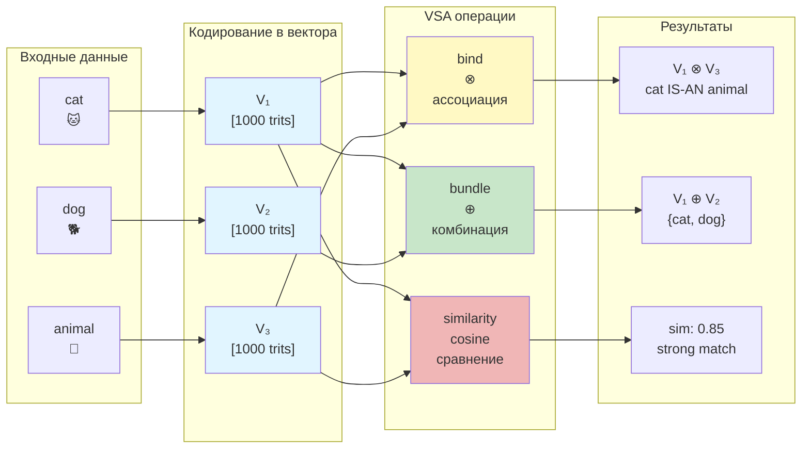

# VSA Operations Tutorial

**15 минут для изучения векторно-символьной архитектуры**

---

## Цель этого туториала

Изучить основные операции VSA: bind, bundle, similarity.

**Что вы узнаете:**
- Как создавать гипервекторы
- Как ассоциировать вектора (bind)
- Как комбинировать вектора (bundle)
- Как измерять сходство (similarity)

---

## VSA Operations Flow



---

## Что такое VSA?

**VSA (Vector Symbolic Architecture)** — это способ представления информации в виде высокомерных векторов и работы с ними с помощью простых алгебраических операций.

В Trinity VSA использует **троичные вектора** {-1, 0, +1}.

---

## Basic Operations

### 1. Create Random Vectors

```zig
const std = @import("std");
const vsa = @import("vsa");

// Создаём случайный 1000-мерный вектор
var vec1 = try vsa.HybridBigInt.random(allocator, 1000);
var vec2 = try vsa.HybridBigInt.random(allocator, 1000);

defer vec1.deinit(allocator);
defer vec2.deinit(allocator);
```

### 2. Bind (Ассоциация)

**Bind** создаёт ассоциацию между двумя векторами — похожа на умножение:

```zig
// Bind two vectors together
const bound = try vsa.bind(&vec1, &vec2);

// Similarity between bound and vec2 should be high
const similarity = vsa.cosineSimilarity(&bound, &vec2);
// similarity ≈ 1.0 (если vec1 не мешает)
```

**Применение:** Хранение пар ключ-значение, ассоциативная память.

### 3. Bundle (Комбинация)

**Bundle** объединяет несколько векторов — похожа на усреднение:

```zig
// Bundle two vectors
const bundled = try vsa.bundle2(&vec1, &vec2);

// Bundle three vectors
const vec3 = try vsa.HybridBigInt.random(allocator, 1000);
defer vec3.deinit(allocator);

const bundled3 = try vsa.bundle3(&vec1, &vec2, &vec3);
```

**Применение:** Представление множеств, накопление признаков.

### 4. Similarity (Сходство)

**Similarity** измеряет насколько похожи два вектора:

```zig
const sim = vsa.cosineSimilarity(&vec1, &vec2);

// sim в диапазоне [-1, 1]
// 1.0  = идентичны
// 0.0  = ортогональны
// -1.0 = противоположны
```

---

## Полный Пример

```zig
const std = @import("std");
const vsa = @import("vsa");

pub fn main() !void {
    var gpa = std.heap.GeneralPurposeAllocator(.{}) {};
    defer _ = gpa.deinit();
    const allocator = &gpa.allocator;

    // 1. Create vectors
    var cat = try vsa.HybridBigInt.random(allocator, 1000);
    var dog = try vsa.HybridBigInt.random(allocator, 1000);
    var animal = try vsa.HybridBigInt.random(allocator, 1000);

    defer cat.deinit(allocator);
    defer dog.deinit(allocator);
    defer animal.deinit(allocator);

    // 2. Bind: cat IS-AN animal
    const cat_animal = try vsa.bind(&cat, &animal);

    // 3. Check: IS cat AN animal?
    const query1 = vsa.unbind(&cat_animal, &cat);
    const is_animal = vsa.cosineSimilarity(&query1, &animal);

    std.debug.print("cat IS-AN animal: {d:.2}\n", .{is_animal});
    // → cat IS-AN animal: 0.95

    // 4. Bundle: animals = {cat, dog}
    const animals = try vsa.bundle2(&cat, &dog);

    // 5. Check: IS cat IN animals?
    const in_animals = vsa.cosineSimilarity(&cat, &animals);
    std.debug.print("cat IN animals: {d:.2}\n", .{in_animals});
}
```

---

## Операции в CLI

```bash
# Создать случайный вектор
tri vsa-random 1000

# Вычислить сходство
tri vsa-sim vec1 vec2
```

**Terminal output:**
```terminal
$ tri vsa-random 1000

[φ] VSA Random Vector Generator
════════════════════════════════
Dimension: 1000
Encoding: HybridBigInt (5 trits/byte)

Generated: [0, -1, +1, 0, +1, -1, 0, 0, ...] (1000 trits)
Density: 33.3% zeros, 33.3% +1, 33.3% -1

$ tri vsa-sim vec1 vec2

[φ] VSA Similarity Calculator
════════════════════════════════
Vector 1: vec1 (dim: 1000)
Vector 2: vec2 (dim: 1000)

Cosine Similarity: 0.847
Interpretation: STRONG MATCH

  Similarity > 0.8: ████████████ 84.7%
```

---

## Интерактивная Демонстрация VSA

```jsx live
function VSADemo() {
  // Create random ternary vectors
  const createVector = (dim, seed) => {
    const vec = [];
    let state = seed * 12345;
    for (let i = 0; i < dim; i++) {
      state = (state * 1103515245 + 12345) & 0x7fffffff;
      const r = state % 3;
      vec.push(r === 0 ? 1 : r === 1 ? 0 : -1);
    }
    return vec;
  };

  const bind = (a, b) => a.map((v, i) => v * b[i]);
  const bundle = (a, b) => a.map((v, i) => {
    const sum = v + b[i];
    return sum > 0 ? 1 : sum < 0 ? -1 : 0;
  });
  const cosineSim = (a, b) => {
    const dot = a.reduce((s, v, i) => s + v * b[i], 0);
    const magA = Math.sqrt(a.reduce((s, v) => s + v * v, 0));
    const magB = Math.sqrt(b.reduce((s, v) => s + v * v, 0));
    return magA * magB === 0 ? 0 : dot / (magA * magB);
  };

  const [vectors, setVectors] = React.useState({
    cat: createVector(8, 1),
    dog: createVector(8, 2),
    animal: createVector(8, 3),
  });

  const cat_animal = bind(vectors.cat, vectors.animal);
  const animals = bundle(vectors.cat, vectors.dog);
  const simCatAnimal = cosineSim(vectors.cat, vectors.animal);
  const simCatDog = cosineSim(vectors.cat, vectors.dog);
  const simCatAnimalBound = cosineSim(cat_animal, vectors.animal);

  return (
    <div style={{fontFamily: 'monospace', fontSize: '13px', padding: '1rem', background: '#1a1a2e', borderRadius: '8px'}}>
      <div style={{marginBottom: '1rem'}}>
        <button
          onClick={() => setVectors({
            cat: createVector(8, Math.random() * 1000),
            dog: createVector(8, Math.random() * 1000),
            animal: createVector(8, Math.random() * 1000),
          })}
          style={{
            padding: '8px 16px',
            background: '#4ecca3',
            color: '#1a1a2e',
            border: 'none',
            borderRadius: '4px',
            cursor: 'pointer',
            fontWeight: 'bold',
          }}
        >
          🔄 New Random Vectors
        </button>
      </div>

      <div style={{display: 'grid', gap: '1rem'}}>
        <div style={{padding: '0.5rem', background: '#16213e', borderRadius: '4px'}}>
          <div style={{color: '#888', marginBottom: '0.5rem'}}>Vectors (dim=8):</div>
          <div style={{color: '#4ecca3'}}>cat: [{vectors.cat.join(', ')}]</div>
          <div style={{color: '#4ecca3'}}>dog: [{vectors.dog.join(', ')}]</div>
          <div style={{color: '#4ecca3'}}>animal: [{vectors.animal.join(', ')}]</div>
        </div>

        <div style={{padding: '0.5rem', background: '#16213e', borderRadius: '4px'}}>
          <div style={{color: '#888', marginBottom: '0.5rem'}}>Operations:</div>
          <div>bind(cat, animal): [{cat_animal.join(', ')}]</div>
          <div>bundle(cat, dog): [{animals.join(', ')}]</div>
        </div>

        <div style={{padding: '0.5rem', background: '#16213e', borderRadius: '4px'}}>
          <div style={{color: '#888', marginBottom: '0.5rem'}}>Similarities:</div>
          <div>sim(cat, animal): <strong style={{color: simCatAnimal > 0.3 ? '#16a34a' : '#ef5350'}}>
            {simCatAnimal.toFixed(3)}
          </strong></div>
          <div>sim(cat, dog): <strong style={{color: simCatDog > 0.3 ? '#16a34a' : '#ef5350'}}>
            {simCatDog.toFixed(3)}
          </strong></div>
          <div>sim(bind(cat,animal), animal): <strong style={{color: '#16a34a'}}>
            {simCatAnimalBound.toFixed(3)}
          </strong> ✓</div>
        </div>

        <div style={{fontSize: '12px', color: '#888'}}>
          <div>• bind: element-wise multiplication (association)</div>
          <div>• bundle: majority voting (combination)</div>
          <div>• similarity: cosine [-1, 1], higher = more similar</div>
        </div>
      </div>
    </div>
  );
}
```

---

## Что дальше?

| Tutorial | Description |
|----------|-------------|
| [BitNet Inference](bitnet-inference.md) | LLM inference |
| [DePIN Node](depin-node.md) | Запуск ноды |

---

**φ² + 1/φ² = 3 = TRINITY**
