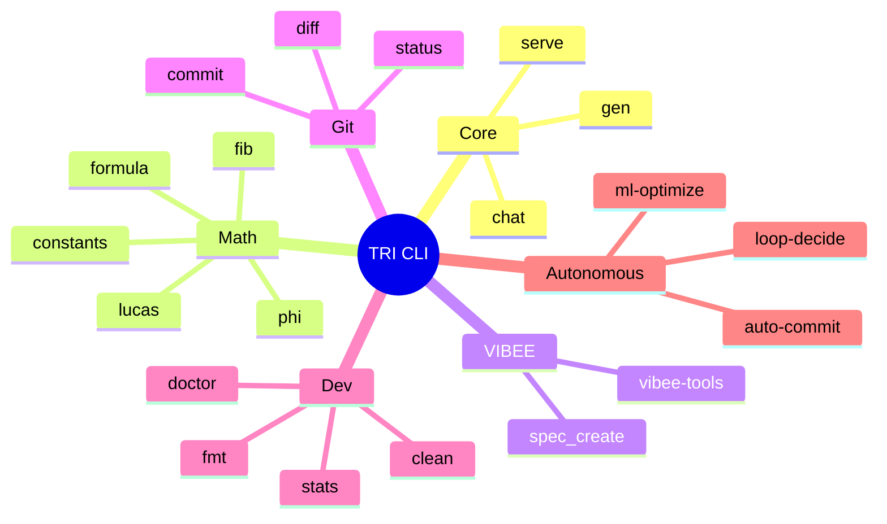

# TRI CLI Cheat Sheet

**Все команды TRI CLI в одном месте**

---

## Command Categories



---

## Essential Commands

### Code Generation

| Command | Description | Example |
|---------|-------------|---------|
| `tri gen <spec.vibee>` | Generate code from VIBEE spec | `tri gen specs/tri/todo.vibee` |
| `tri spec_create <name>` | Create new .vibee spec | `tri spec_create my_feature` |

### AI & Chat

| Command | Description | Example |
|---------|-------------|---------|
| `tri chat "message"` | Interactive AI chat | `tri chat "Explain VSA"` |
| `tri code "prompt"` | Generate code | `tri code "Create Fibonacci"` |

### Server Mode

| Command | Description | Example |
|---------|-------------|---------|
| `tri serve --port 8899` | Start HTTP API server | `tri serve --port 8080` |

---

## Sacred Mathematics

### Constants

```bash
tri constants
```
**Output:**
```
φ (PHI)        = 1.618033988749895
φ² (PHI_SQ)    = 2.618033988749895
TRINITY        = 3.000000000000000
π (PI)         = 3.141592653589793
```

### Golden Ratio Powers

```bash
tri phi 5    # φ⁵ = 11.090169943749474
tri phi 10   # φ¹⁰ = 122.99186938124505
```

### Number Sequences

```bash
tri fib 20    # Fibonacci: F(20) = 6765
tri lucas 10  # Lucas: L(10) = 123
```

### Formulas

```bash
tri formula "phi^2 + 1/phi^2"  # = 3
tri math sacred search 137      # Find formula for value
```

---

## Development Workflow

### System Diagnostics

```bash
tri doctor    # Full system health check
tri stats     # Project statistics
tri clean     # Clean build artifacts
```

### Git Operations

```bash
tri status    # git status --short
tri diff      # git diff
tri log       # git log --oneline -10
tri commit "msg"  # git add -A && commit
```

### Code Quality

```bash
tri fmt       # Format Zig code
tri fix <file>  # Detect and fix bugs
tri explain <file>  # Explain code
```

---

## VIBEE Compiler

### Specification Commands

```bash
tri spec_create my_module          # Create spec template
tri vibee validate specs/tri/*.vibee  # Validate specs
tri vibee koschei                  # Show Golden Chain
```

---

## Autonomous Features

### Auto-Commit

```bash
tri ac                               # Auto commit changes
tri safeguards-disable               # Disable safety limits
```

### Optimization

```bash
tri mlopt                            # ML-based optimization
tri deploy-dashboard                 # Deploy monitoring
```

---

## Demo & Bench Commands

| Cycle | Demo | Bench |
|-------|------|-------|
| Multi-Agent | `tri agents-demo` | `tri agents-bench` |
| Long Context | `tri context-demo` | `tri context-bench` |
| RAG | `tri rag-demo` | `tri rag-bench` |
| Voice | `tri voice-demo` | `tri voice-bench` |
| Vision | `tri vision-demo` | `tri vision-bench` |
| Unified | `tri unified-demo` | `tri unified-bench` |

---

## Quick Reference Card

```
┌─────────────────────────────────────────────┐
│  TRI CLI - Essential Commands               │
├─────────────────────────────────────────────┤
│  tri gen <spec.vibee>      Code generation  │
│  tri chat "msg"           AI chat           │
│  tri serve --port 8080    API server        │
│  tri constants            Sacred math       │
│  tri doctor               System check       │
│  tri help                 All commands      │
└─────────────────────────────────────────────┘
```

---

## Command Aliases

| Alias | Full Command |
|-------|-------------|
| `dr` | `tri doctor` |
| `ac` | `tri auto-commit` |
| `mlopt` | `tri ml-optimize` |
| `dash` | `tri dashboard` |
| `scan` | `tri analyze` |
| `ctx` | `tri context` |

---

## Exit Codes

| Code | Meaning |
|------|---------|
| 0 | Success |
| 1 | General error |
| 2 | Invalid arguments |
| 127 | Command not found |

---

## See Also

- [CLI Reference](/cli/)
- [CLI Visual Guide](/cli/visual-guide)
- [Getting Started](/getting-started/)
- [VIBEE Specification](/vibee/specification)

---

**φ² + 1/φ² = 3 = TRINITY**
