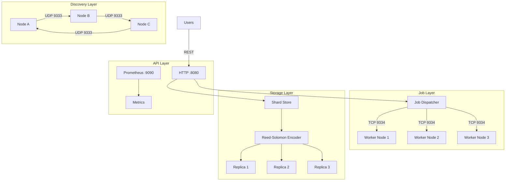

# Trinity DePIN Network

Trinity DePIN (Decentralized Physical Infrastructure Network) is a permissionless network where anyone can contribute compute and storage resources to the Trinity ternary computing ecosystem and earn **$TRI** tokens in return.

## What is Trinity DePIN?

Trinity DePIN transforms idle hardware into productive ternary computing infrastructure. Instead of relying on centralized cloud providers, Trinity distributes workloads across a global network of independently operated nodes. Each node contributes to:

- **Ternary AI inference** -- running models using Trinity's native \{-1, 0, +1\} arithmetic
- **Vector Symbolic Architecture (VSA)** -- binding, bundling, and similarity operations on hypervectors
- **Distributed storage** -- sharding, replicating, and serving data with Reed-Solomon erasure coding
- **WASM-to-ternary compilation** -- converting WebAssembly modules into ternary bytecode

Operators earn $TRI for every useful computation they perform.

## Proof-of-Useful-Work

Unlike traditional Proof-of-Work (PoW) systems that waste energy on hash puzzles, Trinity uses **Proof-of-Useful-Work (PoUW)**. Every computation that earns rewards produces a genuinely useful result:

| PoW (Bitcoin-style) | PoUW (Trinity) |
|---------------------|----------------|
| SHA-256 hash puzzles | VSA evolution, AI inference, storage |
| Energy wasted on difficulty targets | Energy produces real outputs |
| Only miners benefit | Operators + users both benefit |
| Single-purpose hardware (ASICs) | General-purpose hardware (CPU/GPU) |
| No data output | Verifiable computation results |

Each operation is cryptographically signed and its result is verifiable on-chain. A node cannot claim rewards without producing the correct output.

## Network Architecture

## Key Features

### Earn While You Compute

Every useful operation earns $TRI. Run VSA evolutions, serve storage shards, process WASM conversions, or execute benchmarks -- all reward-bearing activities.

### Six Reward Categories

| Operation | Rate | Description |
|-----------|------|-------------|
| VSA Evolution | 0.001 TRI/generation | Evolving hypervector populations |
| Navigation | 0.0001 TRI/step | Navigating semantic vector spaces |
| WASM Conversion | 0.01 TRI/conversion | Compiling WASM to ternary bytecode |
| Benchmark | 0.005 TRI/run | Running reproducible benchmarks |
| Storage Hosting | 0.00005 TRI/shard/hour | Hosting data shards |
| Storage Retrieval | 0.0005 TRI/retrieval | Serving requested data |

### Bonus Multipliers

High-quality work earns more:

- **Fitness bonus** -- evolution fitness > 0.9 grants **+50%** rewards
- **Similarity bonus** -- navigation similarity > 0.8 grants **+100%** rewards
- **Staking bonus** -- staking 100+ TRI grants **1.5x** multiplier on all earnings

### Built on Ternary Math

Trinity's mathematical foundation -- balanced ternary \{-1, 0, +1\} -- delivers 1.58 bits per trit, 20x memory savings over float32, and addition-only compute (no multiply). The network natively speaks ternary, making every operation maximally efficient.

### Open and Permissionless

No registration required. Download the node software, start it, and begin earning. The network uses UDP-based peer discovery -- your node finds peers automatically.

## Next Steps

- [Quick Start](./quickstart.md) -- run a node in 5 minutes
- [Reward Rates](./rewards.md) -- detailed reward breakdown and calculator
- [Tokenomics](./tokenomics.md) -- $TRI supply, allocation, and staking
- [API Reference](./api.md) -- HTTP endpoints for your node
- [Architecture](./architecture.md) -- deep dive into network internals
