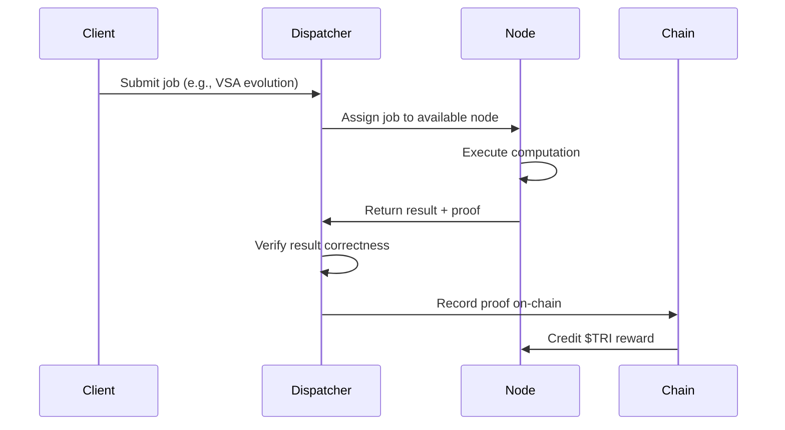

# $TRI Reward Rates

Every useful computation on the Trinity DePIN network earns $TRI. This page details exact reward rates, bonus multipliers, and example earnings scenarios.

## Reward Rates Table

All rates are defined in [`src/firebird/depin.zig`](https://github.com/gHashTag/trinity/blob/main/src/firebird/depin.zig) and enforced on-chain.

| Operation | Rate | Unit | Description |
|-----------|------|------|-------------|
| **VSA Evolution** | 0.001 TRI | per generation | Evolving hypervector populations via genetic algorithms |
| **Navigation** | 0.0001 TRI | per step | Navigating semantic vector spaces (similarity search) |
| **WASM Conversion** | 0.01 TRI | per conversion | Compiling WebAssembly modules to ternary bytecode |
| **Benchmark** | 0.005 TRI | per run | Executing reproducible performance benchmarks |
| **Storage Hosting** | 0.00005 TRI | per shard per hour | Hosting and serving erasure-coded data shards |
| **Storage Retrieval** | 0.0005 TRI | per retrieval | Serving a requested shard to a client |

## Bonus Multipliers

High-quality work is rewarded disproportionately. Bonuses stack with base rewards.

### Evolution Fitness Bonus

| Fitness Score | Bonus | Effective Rate |
|--------------|-------|----------------|
| \> 0.9 | +50% | 0.0015 TRI/generation |
| \> 0.7 | +25% | 0.00125 TRI/generation |
| \<= 0.7 | No bonus | 0.001 TRI/generation |

Fitness is measured as the best-of-population score after each generation. Higher fitness means the evolved hypervector is more useful.

### Navigation Similarity Bonus

| Final Similarity | Bonus | Effective Rate |
|-----------------|-------|----------------|
| \> 0.8 | +100% | 0.0002 TRI/step |
| \> 0.5 | +50% | 0.00015 TRI/step |
| \<= 0.5 | No bonus | 0.0001 TRI/step |

Similarity is measured using cosine similarity between the navigation result and the target vector. Reaching closer to the target earns more.

### Staking Multiplier

| Staked Amount | Multiplier | Effect |
|--------------|------------|--------|
| 100,000+ TRI | 1.5x | All earnings multiplied by 1.5 |
| \< 100,000 TRI | 1.0x | Standard rates |

The staking multiplier applies globally to all operation types. It stacks multiplicatively with fitness and similarity bonuses.

**Example:** A node with 100K+ TRI staked running VSA evolution with fitness 0.95 earns:

```
0.001 TRI (base) + 0.0005 TRI (50% fitness bonus) = 0.0015 TRI
0.0015 TRI * 1.5 (staking multiplier) = 0.00225 TRI per generation
```

## Monthly Earnings Calculator

The following scenarios assume 30 days of continuous operation.

### Scenario 1: Casual Operator

A single node running basic operations, no staking.

| Operation | Volume | Rate | Monthly Earnings |
|-----------|--------|------|-----------------|
| VSA Evolution | 1,000 gen/day | 0.001 TRI | 30.0 TRI |
| Navigation | 5,000 steps/day | 0.0001 TRI | 15.0 TRI |
| Storage Hosting | 100 shards | 0.00005 TRI/hr | 3.6 TRI |
| Storage Retrieval | 200/day | 0.0005 TRI | 3.0 TRI |
| | | **Total** | **51.6 TRI/month** |

### Scenario 2: Active Operator

A dedicated node running high-throughput workloads with quality bonuses.

| Operation | Volume | Effective Rate | Monthly Earnings |
|-----------|--------|----------------|-----------------|
| VSA Evolution | 10,000 gen/day (fitness 0.92) | 0.0015 TRI | 450.0 TRI |
| Navigation | 50,000 steps/day (sim 0.85) | 0.0002 TRI | 300.0 TRI |
| WASM Conversion | 50/day | 0.01 TRI | 15.0 TRI |
| Benchmark | 100/day | 0.005 TRI | 15.0 TRI |
| Storage Hosting | 1,000 shards | 0.00005 TRI/hr | 36.0 TRI |
| Storage Retrieval | 2,000/day | 0.0005 TRI | 30.0 TRI |
| | | **Total** | **846.0 TRI/month** |

### Scenario 3: Staked Power Operator

Same as Active Operator but with 100K+ TRI staked (1.5x multiplier on all earnings).

| | Without Staking | With Staking (1.5x) |
|---|----------------|---------------------|
| Monthly Earnings | 846.0 TRI | **1,269.0 TRI/month** |

## Proof-of-Useful-Work Explained

Trinity's reward system is built on Proof-of-Useful-Work (PoUW). Here is how a single operation flows:



### Verification

Each operation produces a **verifiable proof**:

| Operation | Proof Type |
|-----------|-----------|
| VSA Evolution | Final population fitness score + best vector hash |
| Navigation | Path trace + final similarity score |
| WASM Conversion | Output bytecode hash + instruction count |
| Benchmark | Timing measurements + result hash |
| Storage Hosting | Periodic challenge-response (prove you still hold the shard) |
| Storage Retrieval | Client confirmation + content hash |

If a node submits an incorrect proof, the reward is not credited and the node's reputation score decreases.

## Rate Adjustment

Reward rates are subject to change via governance as the network scales. Factors that influence rate adjustments:

- **Network size** -- more nodes may reduce per-operation rewards
- **Token price** -- rates may adjust to maintain USD-equivalent earnings targets
- **Demand** -- high-demand operation types may see temporary rate boosts
- **Supply** -- the 40% node rewards pool depletes over time, reducing emissions

Current rates are defined as constants in `src/firebird/depin.zig` and will transition to on-chain governance parameters.

## Next Steps

- [Tokenomics](./tokenomics.md) -- understand the full $TRI economy
- [Quick Start](./quickstart.md) -- start your node and begin earning
- [Architecture](./architecture.md) -- how the network verifies work
