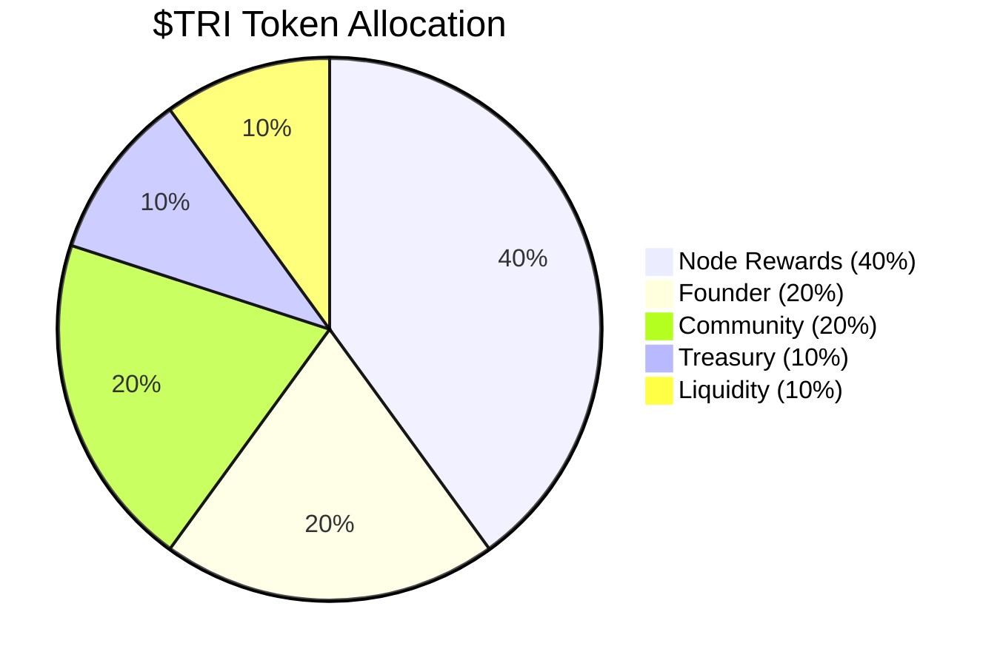

# $TRI Token Economics

$TRI is the native token of the Trinity DePIN network. It rewards node operators, governs protocol parameters, and serves as the unit of account for all on-chain operations.

## Total Supply

```
Total Supply = 3^21 = 10,460,353,203 $TRI
```

The supply is derived from the **Trinity Identity**: the number of unique states representable by 21 balanced ternary trits. This is a fixed, non-inflationary cap -- no additional tokens will ever be minted.

| Property | Value |
|----------|-------|
| Token Symbol | $TRI |
| Token Name | Trinity Token |
| Decimals | 18 |
| Total Supply | 10,460,353,203 (3^21) |
| Network | Ethereum (Sepolia testnet) |

## Allocation



| Category | Percentage | Amount ($TRI) | Purpose |
|----------|-----------|---------------|---------|
| **Node Rewards** | 40% | 4,184,141,281 | Emitted to node operators for useful work |
| **Founder** | 20% | 2,092,070,640 | Core team allocation with vesting |
| **Community** | 20% | 2,092,070,640 | Grants, bounties, ecosystem growth |
| **Treasury** | 10% | 1,046,035,320 | Protocol development and operations |
| **Liquidity** | 10% | 1,046,035,320 | DEX liquidity and market making |

## Vesting Schedules

| Category | Cliff | Vesting Period | Schedule |
|----------|-------|---------------|----------|
| Founder | 12 months | 48 months | Linear monthly after cliff |
| Community | None | 36 months | Linear monthly, governed by DAO |
| Treasury | 6 months | 24 months | Linear monthly after cliff |
| Liquidity | None | Immediate | Available at TGE for DEX pools |
| Node Rewards | None | Ongoing | Emitted per-operation, no cap per period |

### Founder Vesting Example

The founder allocation of 2,092,070,640 TRI vests as follows:

| Month | Cumulative Unlocked | Percentage |
|-------|-------------------|------------|
| 0-12 | 0 | 0% |
| 13 | 58,113,073 | 2.78% |
| 24 | 697,356,880 | 33.33% |
| 36 | 1,394,713,760 | 66.67% |
| 48 | 2,092,070,640 | 100% |

## Node Reward Emissions

The Node Rewards pool (40% of supply) is emitted dynamically based on actual work performed. There is no fixed emission schedule -- rewards flow proportionally to useful computation.

**Estimated emission curve:**

| Year | Estimated Emission | Cumulative | Pool Remaining |
|------|-------------------|------------|----------------|
| 1 | ~400M TRI | 400M | 3,784M |
| 2 | ~600M TRI | 1,000M | 3,184M |
| 3 | ~800M TRI | 1,800M | 2,384M |
| 4 | ~900M TRI | 2,700M | 1,484M |
| 5 | ~700M TRI | 3,400M | 784M |

Emission rates are governed by network activity. As the pool diminishes, per-operation rates may be adjusted via governance to extend the emission timeline.

## Staking

Staking $TRI provides two benefits:

1. **Earnings multiplier** -- stake 100,000+ TRI for a 1.5x multiplier on all node earnings
2. **Governance power** -- staked tokens grant voting rights on protocol parameters

### Staking Tiers

| Tier | Minimum Stake | Multiplier | Governance Weight |
|------|--------------|------------|-------------------|
| Standard | 0 TRI | 1.0x | None |
| Operator | 100,000 TRI | 1.5x | 1x voting power |
| Validator | 1,000,000 TRI | 1.5x | 10x voting power |

### Staking Mechanics

- **Lock period**: 7 days minimum
- **Unstaking**: 7-day cooldown period before tokens are released
- **Slashing**: Nodes that submit fraudulent proofs lose up to 10% of their stake
- **Compounding**: Rewards can be auto-staked to increase the staking balance

## Contract Address

:::caution Testnet Only
$TRI is currently deployed on Ethereum Sepolia testnet. Mainnet deployment is planned for a future milestone.
:::

| Network | Address |
|---------|---------|
| Sepolia Testnet | `0x...` (TBD -- deployment pending) |
| Ethereum Mainnet | Not yet deployed |

## Governance

$TRI holders with staked tokens can vote on:

| Parameter | Current Value | Governance Range |
|-----------|--------------|-----------------|
| VSA Evolution reward rate | 0.001 TRI | 0.0001 -- 0.01 TRI |
| Navigation reward rate | 0.0001 TRI | 0.00001 -- 0.001 TRI |
| WASM Conversion reward rate | 0.01 TRI | 0.001 -- 0.1 TRI |
| Benchmark reward rate | 0.005 TRI | 0.0005 -- 0.05 TRI |
| Storage Hosting rate | 0.00005 TRI | 0.000005 -- 0.0005 TRI |
| Storage Retrieval rate | 0.0005 TRI | 0.00005 -- 0.005 TRI |
| Staking minimum | 100,000 TRI | 10,000 -- 1,000,000 TRI |
| Slashing percentage | 10% | 1% -- 25% |

Governance proposals require a quorum of 5% of staked supply and a simple majority to pass.

## Next Steps

- [Rewards](./rewards.md) -- detailed reward rates and bonus multipliers
- [Quick Start](./quickstart.md) -- start earning $TRI now
- [Architecture](./architecture.md) -- how the network secures the token economy
