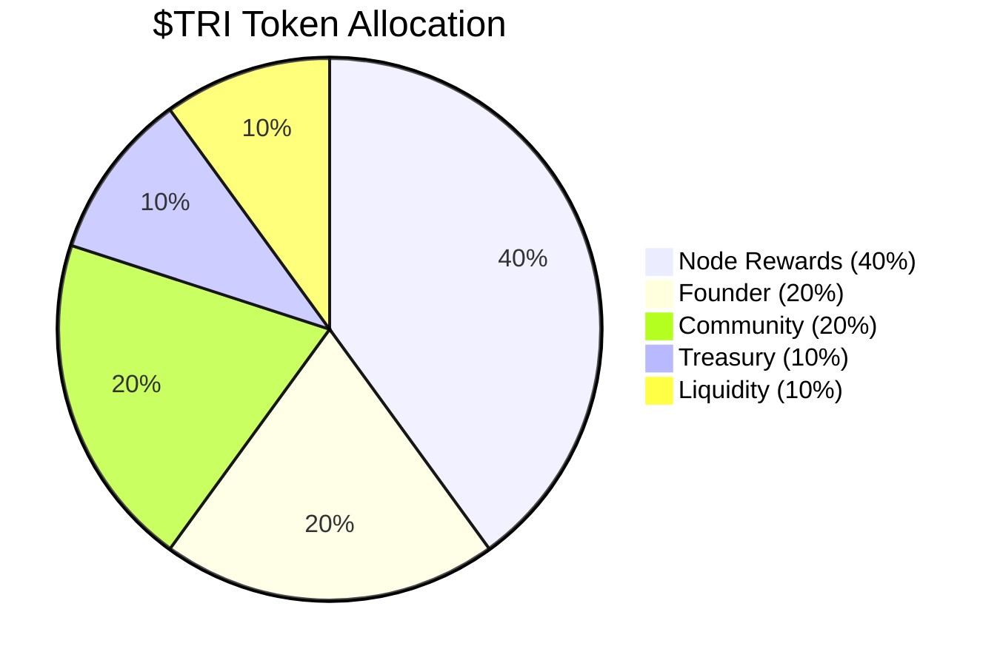

# $TRI Token Economics

$TRI is the native token of the Trinity DePIN network. It rewards node operators, governs protocol parameters, and serves as the unit of account for all on-chain operations.

## Total Supply

```
Total Supply = 3^21 = 10,460,353,203 $TRI
```

The supply is derived from the **Trinity Identity**: the number of unique states representable by 21 balanced ternary trits. This is a fixed, non-inflationary cap -- no additional tokens will ever be minted.

| Property | Value |
|----------|-------|
| Token Symbol | $TRI |
| Token Name | Trinity Token |
| Decimals | 18 |
| Total Supply | 10,460,353,203 (3^21) |
| Network | Ethereum (Sepolia testnet) |

## Allocation



| Category | Percentage | Amount ($TRI) | Purpose |
|----------|-----------|---------------|---------|
| **Node Rewards** | 40% | 4,184,141,281 | Emitted to node operators for useful work |
| **Founder** | 20% | 2,092,070,640 | Core team allocation with vesting |
| **Community** | 20% | 2,092,070,640 | Grants, bounties, ecosystem growth |
| **Treasury** | 10% | 1,046,035,320 | Protocol development and operations |
| **Liquidity** | 10% | 1,046,035,320 | DEX liquidity and market making |

## Vesting Schedules

:::note Smart Contract Only
Vesting is implemented in `TrinityToken.sol` on-chain. The node software (`depin.zig`) does not enforce vesting -- it is handled at the contract level.
:::

| Category | Cliff | Vesting Period | Schedule |
|----------|-------|---------------|----------|
| Founder | 12 months | 48 months | Linear monthly after cliff |
| Community | None | 36 months | Linear monthly, governed by DAO |
| Treasury | 6 months | 24 months | Linear monthly after cliff |
| Liquidity | None | Immediate | Available at TGE for DEX pools |
| Node Rewards | None | Ongoing | Emitted per-operation, no cap per period |

## Node Reward Emissions

The Node Rewards pool (40% of supply) is emitted dynamically based on actual work performed. There is no fixed emission schedule -- rewards flow proportionally to useful computation.

**Estimated emission curve:**

| Year | Estimated Emission | Cumulative | Pool Remaining |
|------|-------------------|------------|----------------|
| 1 | ~400M TRI | 400M | 3,784M |
| 2 | ~600M TRI | 1,000M | 3,184M |
| 3 | ~800M TRI | 1,800M | 2,384M |
| 4 | ~900M TRI | 2,700M | 1,484M |
| 5 | ~700M TRI | 3,400M | 784M |

Emission rates are governed by network activity. As the pool diminishes, per-operation rates may be adjusted via governance to extend the emission timeline.

## Staking

Staking $TRI provides two benefits:

1. **Earnings multiplier** -- stake 100+ TRI for a 1.5x multiplier on all node earnings
2. **Governance power** -- staked tokens grant voting rights on protocol parameters (planned)

### Staking Parameters

Values from [`src/trinity_node/token_staking.zig`](https://github.com/gHashTag/trinity/blob/main/src/trinity_node/token_staking.zig):

| Parameter | Value | Source |
|-----------|-------|--------|
| Minimum Stake | **100 TRI** | `token_staking.zig:17` |
| Earnings Multiplier | **1.5x** (when staked) | `depin.zig` |
| PoS Failure Slash Rate | **1%** per failure | `token_staking.zig:19` |
| Corruption Slash Rate | **5%** per corruption event | `token_staking.zig:21` |
| Min Reputation for Staking | **0.2** (20%) | `token_staking.zig:23` |

### Staking Tiers (API Access)

Staked $TRI determines your API tier. Higher stakes unlock higher rate limits, reward multipliers, and full endpoint access. Defined in [`src/trinity_node/http_api.zig`](https://github.com/gHashTag/trinity/blob/main/src/trinity_node/http_api.zig).

| Tier | Staked $TRI | Rate Limit | Reward Multiplier | API Access |
|------|------------|------------|-------------------|------------|
| **Free** | 0 | 10 req/min | 1.0x | /health, /node/status, /metrics, /rewards/rates, /node/tier |
| **Staker** | 100+ TRI | 60 req/min | 1.5x | All endpoints |
| **Power** | 1,000+ TRI | 300 req/min | 2.0x | All endpoints + priority jobs |
| **Whale** | 10,000+ TRI | Unlimited | 3.0x | All endpoints + dedicated worker pool |

Identity is wallet-based: include your wallet address via the `X-Wallet` HTTP header. No API keys required -- your staked amount is your subscription.

### Staking Mechanics

- **Minimum stake**: 100 TRI to activate the Staker tier (1.5x earnings multiplier)
- **Reputation requirement**: Nodes must maintain a reputation score above 0.2 to remain staked
- **Slashing**: PoS failures lose 1% of stake; data corruption loses 5% of stake
- **Compounding**: Rewards can be re-staked to increase the staking balance

:::note Planned Features
The following features are designed but not yet implemented in the node software:
- **Lock period**: 7 days minimum (planned)
- **Unstaking cooldown**: 7-day cooldown period (planned)
- **Governance tiers**: Tiered voting power based on stake amount (planned)
:::

## Contract Address

:::caution Testnet Only
$TRI is currently deployed on Ethereum Sepolia testnet. Mainnet deployment is planned for a future milestone.
:::

| Network | Address |
|---------|---------|
| Sepolia Testnet | `0x...` (TBD -- deployment pending) |
| Ethereum Mainnet | Not yet deployed |

## Governance

$TRI holders with staked tokens can vote on:

| Parameter | Current Value | Governance Range |
|-----------|--------------|-----------------|
| VSA Evolution reward rate | 0.001 TRI | 0.0001 -- 0.01 TRI |
| Navigation reward rate | 0.0001 TRI | 0.00001 -- 0.001 TRI |
| WASM Conversion reward rate | 0.01 TRI | 0.001 -- 0.1 TRI |
| Benchmark reward rate | 0.005 TRI | 0.0005 -- 0.05 TRI |
| Storage Hosting rate | 0.00005 TRI | 0.000005 -- 0.0005 TRI |
| Storage Retrieval rate | 0.0005 TRI | 0.00005 -- 0.005 TRI |
| Staking minimum | 100 TRI | 10 -- 10,000 TRI |
| PoS failure slash rate | 1% | 0.1% -- 10% |
| Corruption slash rate | 5% | 1% -- 25% |

Governance proposals require a quorum of 5% of staked supply and a simple majority to pass.

## Next Steps

- [Rewards](./rewards.md) -- detailed reward rates and bonus multipliers
- [Quick Start](./quickstart.md) -- start earning $TRI now
- [Architecture](./architecture.md) -- how the network secures the token economy
